# 对话幕布结构分析（共享会话 + 各 CLI）

> 分析日期：2026-07-31  
> 校准日期：2026-07-31（二次源码 review，见 §12）  
> 范围：前端对话幕布（Conversation Canvas / Messages 时间线）  
> 事实源：当前仓库源码（`src/features/messages/**`、`src/features/layout/**`、`src/features/threads/**`、`src/features/shared-session/**`、`src/conversation-presentation/**`）  
> 说明：文中「幕布」= 中心对话区渲染表面，不是 Intent Canvas（意图画板），也不是底部 Status Panel / Composer。

---

## 0. 结论先行

| 维度 | 结论 |
|------|------|
| **统一渲染核** | 所有 native CLI 与 shared session 最终都进同一套 `Messages → MessagesCore → MessagesTimeline → TimelineRowRenderer` |
| **差异分层** | **L1 数据入口**（loader / adapter / shared projection）差异最大；**L2 引擎硬分支**（bash 隐藏、协作 badge、staged MD）常驻生效；**L3 presentationProfile** 默认 **关闭**，多数 profile 字段当前不生效 |
| **Shared 特殊性** | `threadKind === "shared"` + `threadId` 前缀 `shared:`；历史走 `createSharedHistoryLoader`（Legacy snapshot ⊕ SharedProjection）；发送 chrome 走 `SharedSendStatusBar` / send state machine |
| **Canonical item kinds** | `message` / `reasoning` / `diff` / `review` / `explore` / `generatedImage` / `tool` |
| **Builtin engines** | `claude` / `codex` / `gemini` / `grok` / `kimi` / `opencode` |
| **Shared 可执行引擎** | `claude` / `codex` / `kimi` / `grok` / `opencode`（**不含 gemini**） |
| **默认开关（校准）** | `chatCanvasUseNormalizedRealtime=true`；`chatCanvasUseUnifiedHistoryLoader=true`；`chatCanvasUsePresentationProfile=false` |
| **幕布边界** | bash/command 在 Claude/Codex 幕布隐藏，活动细节多落在 **Status Panel**（同屏 sibling，不在 Messages 树内） |

---

## 1. 「幕布」在系统中的位置

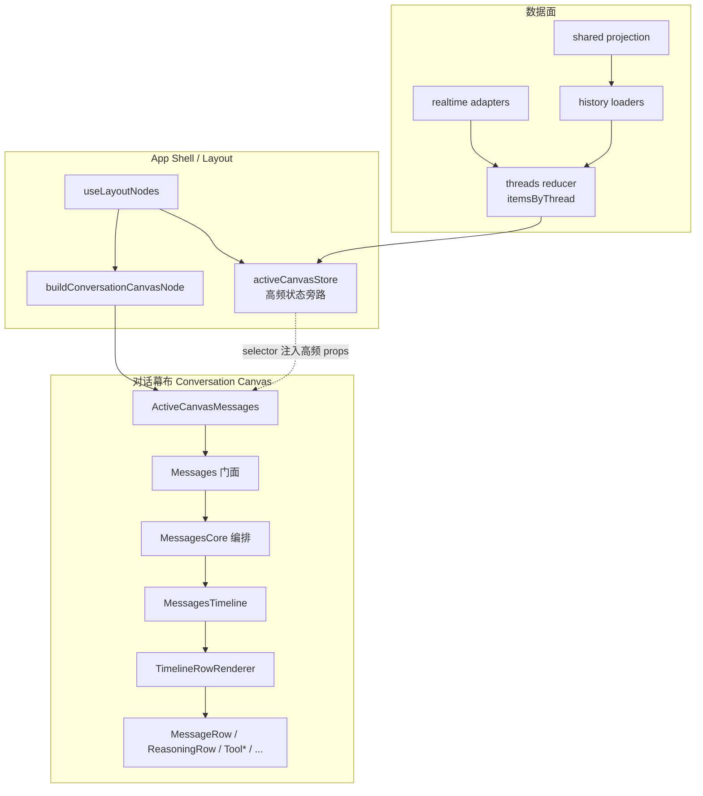

### 1.1 挂载入口

| 层 | 文件 | 职责 |
|----|------|------|
| Layout 组装 | `src/features/layout/hooks/useLayoutNodes.tsx` | 组 `conversationState` / `presentationProfile` / fork dialog；判断 `isSharedSession`；挂 Composer 旁 `SharedSendStatusBar` |
| Canvas 节点 | `src/features/layout/hooks/conversationCanvasNode.tsx` | `ActiveCanvasMessages` + `MessageForkConfirmDialog` + 可选 `ProviderContinuationContextCard`（`timelineLeadingNode`） |
| 高频状态 | `src/features/layout/hooks/activeCanvasStore.ts` | 把 `items / conversationState / isThinking / approvals…` 从 Shell 大树旁路，避免心跳等打穿整树 |
| 门面 | `src/features/messages/components/Messages.tsx` | `adaptLegacyMessagesProps` → `MessagesCore` |
| 编排 | `src/features/messages/components/MessagesCore.tsx` | 可见窗口、滚动、runtime/presentation hooks、组装 timeline models |
| 时间线 | `src/features/messages/components/MessagesTimeline.tsx` | projection rows + 虚拟化/轻量模式 + 逐行 `TimelineRowRenderer` |
| 行分发 | `src/features/messages/timeline/components/TimelineRowRenderer.tsx` | `kind` → 具体 Row / ToolBlock / Group |

---

## 2. 统一渲染管线（所有幕布共用）

### 2.1 数据 → 可见行

```text
ConversationItem[]
  → filter / dedupe / live window / collapse middle steps
  → groupToolItems()          # read/edit/bash/search 连续同类合并
  → buildTimelineProjectionRows()
      entry | dockedReasoning | tailUserInput | liveMiddleCollapsed
      | workingIndicator | emptyState | historyRecoveryFailure | approval | bottomAnchor
  → TimelineRowRenderer.renderProjectionRow / renderLightweightProjectionRow
  → ConversationRowErrorBoundary 包裹
```

关键代码：

- 分组：`src/features/messages/utils/groupToolItems.ts`
- 投影：`src/features/messages/timeline/projection/messagesTimelineProjection.ts`
- 行渲染：`src/features/messages/timeline/components/TimelineRowRenderer.tsx`
- 契约 kinds：`src/features/threads/contracts/conversationCurtainContracts.ts`

### 2.2 Canonical Item Kinds → 组件映射

| `item.kind` | 渲染组件 | 备注 |
|-------------|----------|------|
| `message` | `MessageRow` | user / assistant；assistant 可挂 final boundary + 操作栏 |
| `reasoning` | `ReasoningRow` | 可折叠；live 态展开 |
| `tool` | `ToolBlockRenderer` → 子块 | 可被引擎策略隐藏（见 §4） |
| `review` | `ReviewRow` | Markdown 正文 |
| `diff` | `DiffRow` | `DiffBlock` |
| `explore` | `ExploreRow` | 可折叠 inline 摘要 |
| `generatedImage` | `GeneratedImageRow` | 缩略图 + lightbox |

### 2.3 工具块分发（`ToolBlockRenderer`）

文件：`src/features/messages/components/toolBlocks/ToolBlockRenderer.tsx`

| 优先级 | 条件 | 组件 |
|--------|------|------|
| 0 | `toolType === requestUserInputSubmitted` | `RequestUserInputSubmittedBlock` |
| 1 | ExitPlanMode 工具名 | `GenericToolBlock`（保留 plan handoff 卡） |
| 2 | `commandExecution` 或 bash 类 | `BashToolBlock` |
| 3 | read 类 | `ReadToolBlock` |
| 4 | edit/write 类 | `EditToolBlock` |
| 5 | search/grep/glob 类 | `SearchToolBlock` |
| 6 | MCP | `McpToolBlock` |
| 7 | 其他（含 fileChange） | `GenericToolBlock` |

### 2.4 工具分组（`groupToolItems` → Group Block）

| GroupedEntry | 组件 | 引擎差异 |
|--------------|------|----------|
| `readGroup` | `ReadToolGroupBlock` | 全引擎 |
| `editGroup` | `EditToolGroupBlock` | 全引擎；edit + fileChange 归并为 fileEdit 场景 |
| `bashGroup` | `BashToolGroupBlock` | **codex 永远隐藏；claude 非 transcript-fallback 时隐藏** |
| `searchGroup` | `SearchToolGroupBlock` | 全引擎 |
| `item` | 单行 `renderSingleItem` | 单工具走 `ToolBlockRenderer` |

另：`TodoWrite` / `todo_write` 在分组阶段 `shouldHideToolItemForRender` 直接剔除。

### 2.5 Timeline 非 item 行

| Projection kind | 组件/UI | 作用 |
|-----------------|---------|------|
| `dockedReasoning` | `ReasoningRow`（Claude live dock） | 把 live reasoning 钉在时间线尾部 |
| `tailUserInput` | `MessagesInlineUserInput` slot | pending user input 表单锚在末尾 |
| `liveMiddleCollapsed` | 折叠提示条 | 流式中间步骤折叠 |
| `workingIndicator` | `WorkingIndicator` | 运行中/等待首 token/心跳提示 |
| `emptyState` | 空态 / 恢复中 / 隐藏思考 | 无内容或策略隐藏 |
| `historyRecoveryFailure` | 恢复失败卡 | 重试历史 |
| `approval` | `MessagesInlineApproval` slot | 审批 UI |
| `bottomAnchor` | 占位 | 滚动锚点 |

### 2.6 消息行（`MessageRow`）内部子组件

文件：`src/features/messages/rows/components/MessageRow.tsx`  
呈现：`messageRowPresentation.ts` / `messagesUserPresentation.ts`

| 子面 | 组件 | 何时出现 |
|------|------|----------|
| 用户正文 | `CollapsibleUserTextBlock` | user message |
| 代码批注上下文 | `UserCodeAnnotationContextBlock` | user 带 annotation |
| 记忆摘要 | Memory summary 卡（展开/弹窗） | user 带 memory context 且未 suppress |
| 笔记卡摘要 | `NoteCardContextSummaryCard` | user 带 note-card context |
| Intent 画板摘要 | `IntentCanvasContextSummaryCard` | user 带 intent canvas attachments |
| 浏览器上下文 | `ConversationBrowserContextSummaryCard` | browser context metadata |
| Agent 徽章 | `AgentIcon` + badge | selected agent / external agent |
| 协作模式 badge | 仅 `enableCollaborationBadge` | **仅 codex** 开启（Timeline 传入） |
| 图片 | `MessageImageGrid` / `LocalImage` / `ImageLightbox` | message images |
| Assistant Markdown | `Markdown` 或 lightweight / plain 流式面 | 见 presentationProfile + stream mitigation |
| Live 正文 | `useLiveAssistantText` channel | flag `liveTextExternalization`；流式 assistant |
| 任务输出 | `EngineTaskOutputInspector` | agent task notification 文本 |
| 运行时恢复 | `RuntimeReconnectCard` | reconnect 目标消息 |

### 2.7 幕布周边 chrome（同屏但不在时间线行内）

| 组件 | 位置 | 说明 |
|------|------|------|
| `MessagesAnchorRail` | 侧锚 | 用户消息导航轨（仅 user 预览，避免流式打穿） |
| `ScrollControl` | 底/侧 | 跟随底部 / 跳转 |
| `MessagesOutlineFloater` | 大纲浮层 | 产品决策 `SHOW_OUTLINE_FLOATER = false`（2026-07-03 隐藏） |
| `MessagesLinkedRunBanner` | 顶栏类 | linked run 提示 |
| `TurnFilesChangedCard` | 行后 / 会话累计 | turn 边界文件变更摘要 |
| `MessageForkConfirmDialog` | Canvas 节点 sibling | fork 确认；codex 可带 provider 选择器 |
| `SharedSendStatusBar` | Composer 上方 | **仅 shared session** |
| `ProviderContinuationContextCard` | `timelineLeadingNode` | provider-continuation 来源会话摘要 |

---

## 3. 共享会话幕布（Shared Session）

### 3.1 身份与边界

| 字段 | 值 / 来源 |
|------|-----------|
| `threadKind` | `"shared"`（`activeThreadSummary`） |
| `threadId` 前缀 | `shared:` |
| History loader | `createSharedHistoryLoader`（`useThreadActions.historyLoaderFactory.ts`） |
| 可执行 engine | `claude \| codex \| kimi \| grok \| opencode`（`sharedSessionEngines.ts`）；非法回落 `claude` |
| 当前执行目标 | `selectedTarget` / `selectedEngine` + targetStore |
| 发送状态机 | `sharedSendStateStore` + `sendStateMachine` |
| 投影数据源 | Rust SharedProjector → `SharedProjectionItem[]` → `toSharedConversationItems` |

### 3.2 Shared 历史数据路径

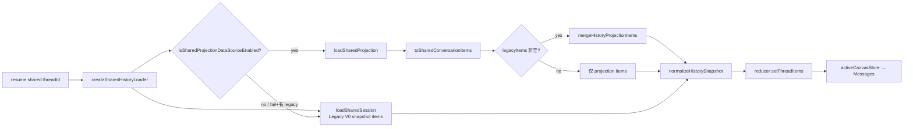

要点：

1. **与 Native 隔离**：`sharedProjection/dataSource.ts` 明确不 import `threadItems`。
2. **映射 kinds**：`message / reasoning / tool / generatedImage / diff / review / explore`；`systemNotice / metadata` 丢弃（Shadow 观测面，不进幕布）。
3. **Shared 消息可带**：`engineSource`、`executionTargetSnapshot`（turn badge / 目标切换痕迹）。
4. **Loader 的 `engine` 字段**在类型上标成 `"codex"` 工厂默认值，但 snapshot.meta.engine 使用 **当前 selectedEngine / persisted target**。

### 3.3 Shared 实时 / 发送与幕布的关系

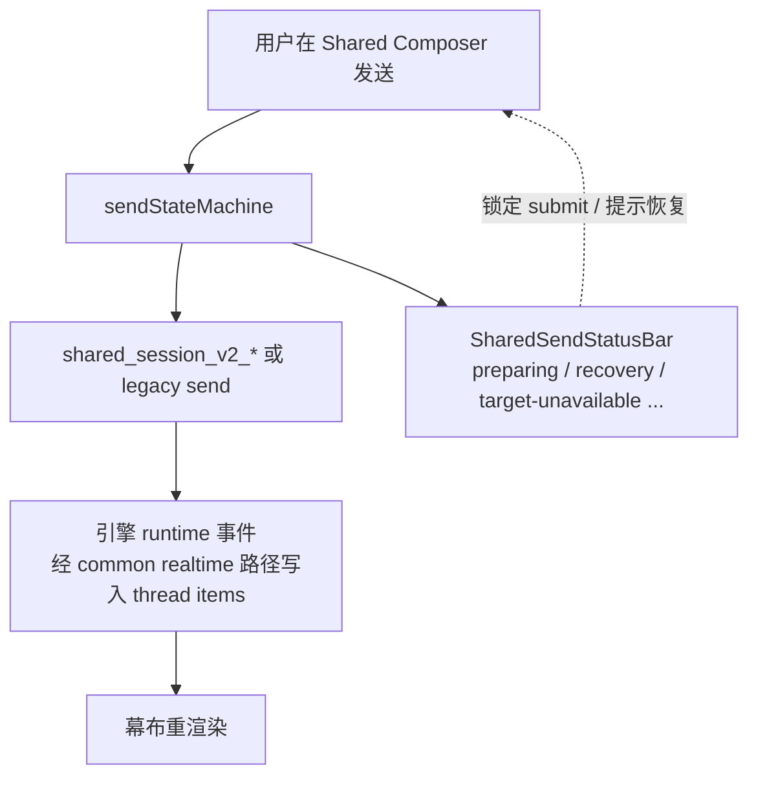

幕布本体仍渲染 `ConversationItem[]`；Shared 额外 UI：

- **SharedSendStatusBar**：发送九态提示、recovery-required 重建 binding、target-unavailable
- **ProviderContinuationContextCard**：continuation 线程来源（`originKind === provider-continuation`）
- Composer：`isSharedSession` 控制锁输入/锁提交（`isComposerInputLocked` / `isComposerSubmitLocked`）

### 3.4 Shared 幕布组件清单（渲染面）

与 native **同一套** TimelineRow 组件；差异在数据与 chrome：

| 层 | Shared 特有 | Native 共有 |
|----|-------------|-------------|
| 历史 | SharedProjection merge | 引擎专属 loader |
| 行组件 | 同 MessageRow/Tool… | 同 |
| Turn 徽章 | 可读 `executionTargetSnapshot` / `engineSource` | 通常固定引擎 |
| 发送 chrome | SharedSendStatusBar | 无 |
| 协作 badge | 仅当 **当前 activeEngine === codex** | 同规则 |

---

## 4. 引擎差异：Presentation Profile & 幕布策略

### 4.0 开关矩阵（默认运行态，校准后）

来源：`src/features/settings/hooks/useAppSettings.ts` + `useLayoutNodes` / `useThreads` / `useAppServerEvents`。

| 开关 | 默认 | 对幕布的实际影响 |
|------|------|------------------|
| `chatCanvasUseNormalizedRealtime` | **true** | 实时优先走 `*RealtimeAdapter → mapCommonRealtimeEvent` |
| `chatCanvasUseUnifiedHistoryLoader` | **true** | 历史优先走 `createThreadHistoryLoaderForThread` 统一 loader |
| `chatCanvasUsePresentationProfile` | **false** | `resolvePresentationProfile` 结果常为 `null`；profile 专属字段大多 **不生效** |
| Shared Projection DataSource | **true**（可 localStorage / env 回滚） | Shared 历史默认 merge projection |
| `TIMELINE_ADAPTIVE_RENDERING_ENABLED` | true | 重历史可虚拟化 / lightweight |
| `TIMELINE_VIRTUALIZATION_DURING_STREAMING_ENABLED` | **false** | 流式期不用虚拟列表，靠 `STREAMING_VISIBLE_WINDOW=60` 尾窗 |
| `claudeThinkingVisible` | **true**（AppShell 硬编码） | Claude reasoning 默认显示；legacy dock 路径默认 **不走** |

### 4.1 Presentation Profile（仅当开关打开时）

文件：`src/conversation-presentation/presentationProfile.ts`  
装配：`useLayoutNodes` 仅在 `options.usePresentationProfile === true` 时调用 `resolvePresentationProfile`。

| Profile 字段 | codex | opencode | 其他（claude/gemini/grok/kimi） | 默认关闭时是否仍有硬编码等价物 |
|--------------|-------|----------|----------------------------------|--------------------------------|
| `preferCommandSummary` | ✅ | ❌ | ❌ | **有**：`resolveWorkingActivityLabel` 在 profile 为空时对 **codex** 仍 prefer summary |
| `codexCanvasMarkdown` | ✅ | ❌ | ❌ | 无（仅 profile） |
| `showReasoningLiveDot` | ✅ | ❌ | ❌ | 无（仅 profile） |
| `heartbeatWaitingHint` | ❌ | ✅ | ❌ | 无（仅 profile） |
| `useCodexStagedMarkdownThrottle` | ✅ | ❌ | ❌ | **有更强硬编码**：`shouldUseStagedStreamingMarkdown` 对 **codex \|\| claude** 恒 true |
| throttle ms | 80 / 180 | 80 / 180 | 80 / 180 | 有 fallback 常量 |

> 💡 **校准 Insight**：不要把 profile 表当成「用户默认就能看到的行为」。默认 `presentationProfile=null` 时，真正常驻的是 **引擎硬分支**（§4.2）+ staged MD 硬编码（claude/codex）。

### 4.2 幕布层引擎分支（渲染期，与 profile 无关）

| 策略 | 代码位置 | 行为 | 默认是否生效 |
|------|----------|------|--------------|
| 隐藏 bash / command 卡 | `shouldHideCodexCanvasCommandCard` | **codex + claude** 隐藏 `commandExecution`/bash 单卡（ExitPlanMode 除外） | ✅ 常驻 |
| 隐藏 bashGroup | `TimelineRowRenderer.renderEntry` | **codex** 全隐藏；**claude** 在非 history-transcript-fallback 时隐藏 | ✅ 常驻 |
| 协作 badge | `enableCollaborationBadge = activeEngine === "codex"` | 仅 codex | ✅ 常驻 |
| 流式 MessageRow | `liveAssistantMessageId` | 6 引擎均可 | ✅ 常驻 |
| staged lightweight markdown | `shouldUseStagedStreamingMarkdown` | **claude + codex** 强制 staged（profile 可额外开） | ✅ 常驻 |
| long folded streaming | `MessageRow` | **仅 claude** 超长流式折叠 | ✅ 常驻 |
| plain-text streaming surface | `MessageRow` | **非 codex** 且 stream mitigation 打开 | 条件生效 |
| prefer command activity label | `resolveWorkingActivityLabel` | codex 优先 command summary（profile 空也生效） | ✅ 常驻 |
| docked reasoning | `claudeDockedReasoningItems` | 仅 `legacyClaudeReasoningDockEnabled` | ❌ **默认不生效** |
| hide Claude reasoning | `hideClaudeReasoning` | `claudeThinkingVisible === false` 时隐藏 | 默认 visible=true → 显示 |
| history transcript fallback | `claudeHistoryTranscriptFallbackActive` | 重 transcript + 无可渲染折叠条目时放开 bash 组等 | 条件生效 |
| reasoning 段去重 | `dedupeAdjacentReasoningItems` | gemini/grok/kimi/opencode 占位段合并 | ✅ 常驻 |
| WorkingIndicator 心跳文案 | `heartbeatWaitingHint` | 需 profile=opencode | ❌ 默认 profile 关 |
| Fork provider 选择器 | layout fork dialog | `conversationEngine === "codex"` | ✅ 常驻 |

**Claude docked reasoning 真实门闩**（`MessagesCore.tsx`）：

```text
legacyClaudeReasoningDockEnabled =
  activeEngine === "claude"
  && typeof claudeThinkingVisible !== "boolean"
  && shouldHideClaudeReasoningModule()   // localStorage flag
```

当前 AppShell 将 `claudeThinkingVisible` **硬编码为 `true`（boolean）**，因此 `legacyClaudeReasoningDockEnabled === false`，`claudeDockedReasoningItems` 恒为空数组。投影类型仍保留 `dockedReasoning`，但是 **死路径 / 遗留能力**，不是默认产品行为。

### 4.3 Realtime Adapter 差异

全部在 `src/features/threads/adapters/*RealtimeAdapter.ts`，核心都是 `mapCommonRealtimeEvent`。  
默认 `chatCanvasUseNormalizedRealtime=true`，优先 `tryRouteNormalizedRealtimeEvent`。

| Engine | 关键 option |
|--------|-------------|
| **codex** | `agentMessageSnapshotMode: "snapshot"`（快照模式，无 text delta alias） |
| **claude / gemini / grok / kimi / opencode** | `allowTextDeltaAlias: true` |

### 4.4 History Loader 选择（threadId 前缀）

`createThreadHistoryLoaderForThread`：

| 前缀 | Loader | 数据来源摘要 |
|------|--------|--------------|
| `shared:` | `createSharedHistoryLoader` | loadSharedSession + loadSharedProjection |
| `claude:` | `createClaudeHistoryLoader` | Claude JSONL session + shadow recovery |
| `gemini:` | `createGeminiHistoryLoader` | gemini session → `parseGeminiHistoryMessages`（复用 Claude 解析器族） |
| `grok:` | `createGrokHistoryLoader` | grok session parser |
| `kimi:` | `createKimiHistoryLoader` | kimi session parser |
| `opencode:` | `createOpenCodeHistoryLoader` | `resumeThread` + `buildItemsFromThread` |
| 默认（codex / 无前缀） | `createCodexHistoryLoader` | resumeThread + 本地 codex session 融合 |

---

## 5. 逐 CLI 幕布流程图（Mermaid）

下列「幕布」均汇合到 **同一 Messages 渲染核**；图重点画 **该引擎独有的上下游**。

### 5.1 Claude Code

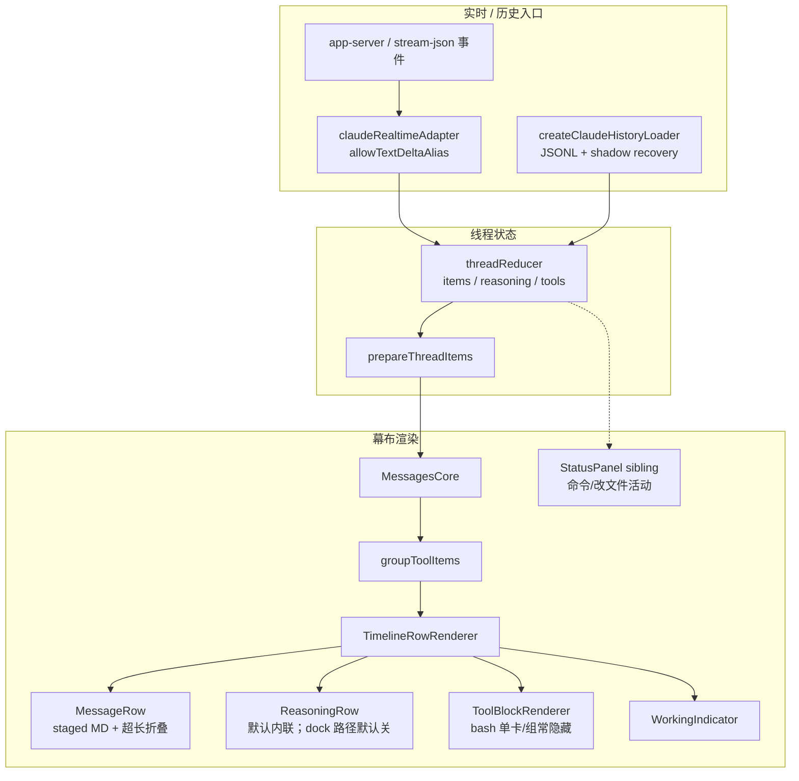

**Claude 幕布特征（校准后）**

- staged lightweight markdown 与 codex **同等硬编码开启**（不依赖 presentationProfile）
- reasoning 默认内联显示（`claudeThinkingVisible=true`）；**dockedReasoning 默认不启用**
- 历史 transcript 很重且折叠后无可渲染条目时，触发 `claudeHistoryTranscriptFallbackActive`（bash 组可露出）
- 流式超长文本可折叠 head/tail（Claude 独有）
- bash/command 默认不进幕布；活动摘要在 **底部 Status Panel**

### 5.2 Codex CLI

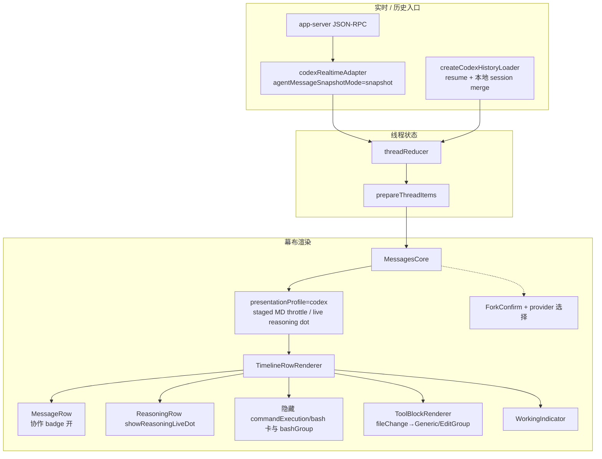

**Codex 幕布特征（校准后）**

- 常驻：bash/command 隐藏、协作 badge、staged MD、activity 优先 command summary、Fork provider 选择器
- profile 打开后才额外增强：`codexCanvasMarkdown` / `showReasoningLiveDot` / 更完整的 profile 节流表
- 默认 `presentationProfile=null` 时，**不是**「全套 codex profile 都生效」

### 5.3 Gemini CLI

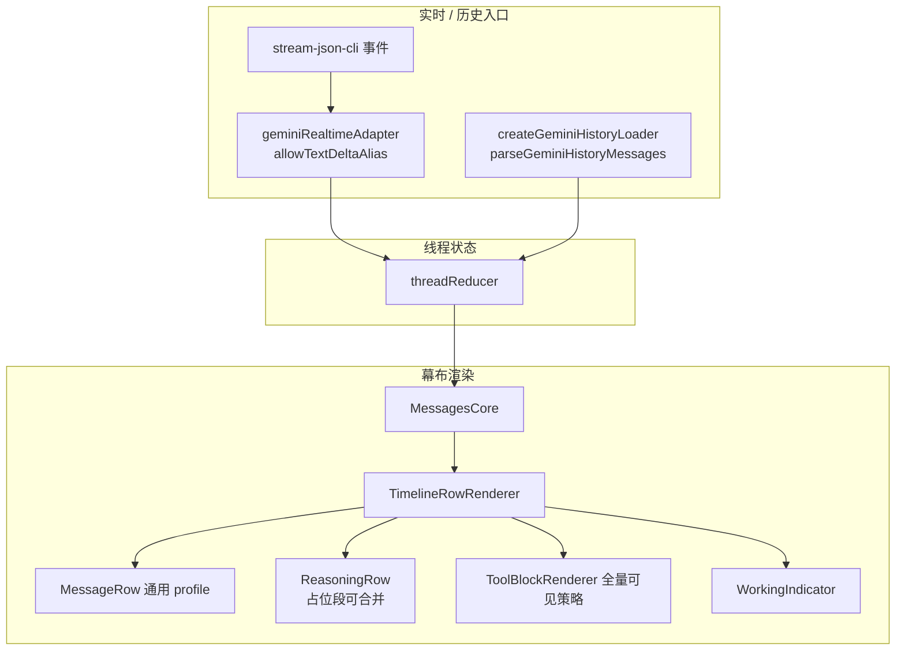

**Gemini 幕布特征（校准后）**

- 不在 shared session 支持列表
- **无** staged lightweight markdown 硬编码（仅 claude/codex）
- bash 卡**不会**被 `shouldHideCodexCanvasCommandCard` 隐藏 → 幕布更「工具原貌」
- reasoning 去重对 generic placeholder 更激进
- 有 `conversationMigrationGates.gemini`（assembler/profile 迁移门闩，与 Claude 同类）

### 5.4 Grok CLI

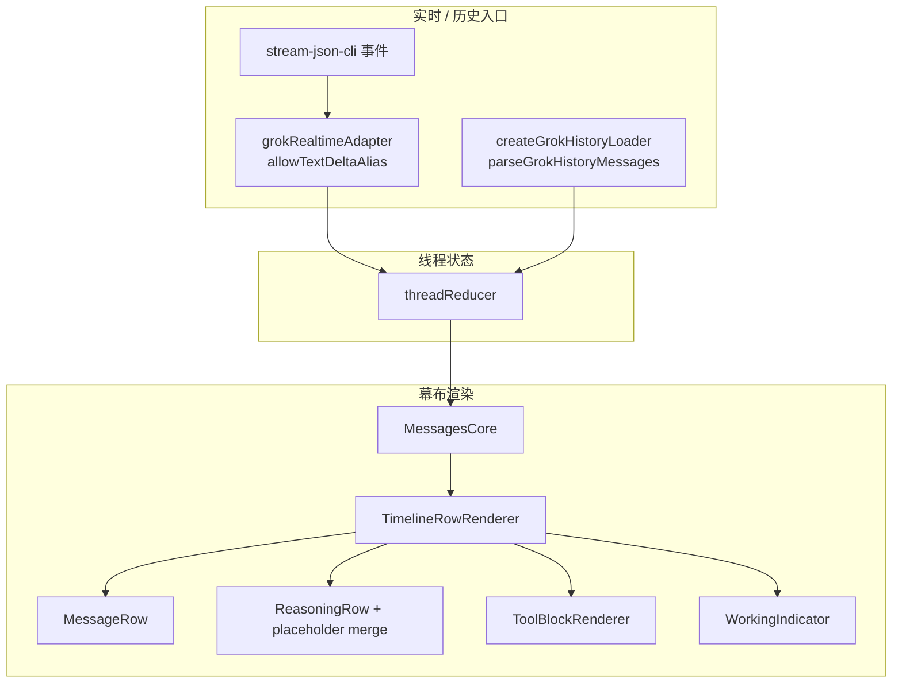

**Grok 幕布特征**

- 与 kimi/gemini 同属「stream-json + Claude 解析器族」形态
- 支持 Shared Session
- 幕布 UI 策略接近默认 profile

### 5.5 Kimi CLI

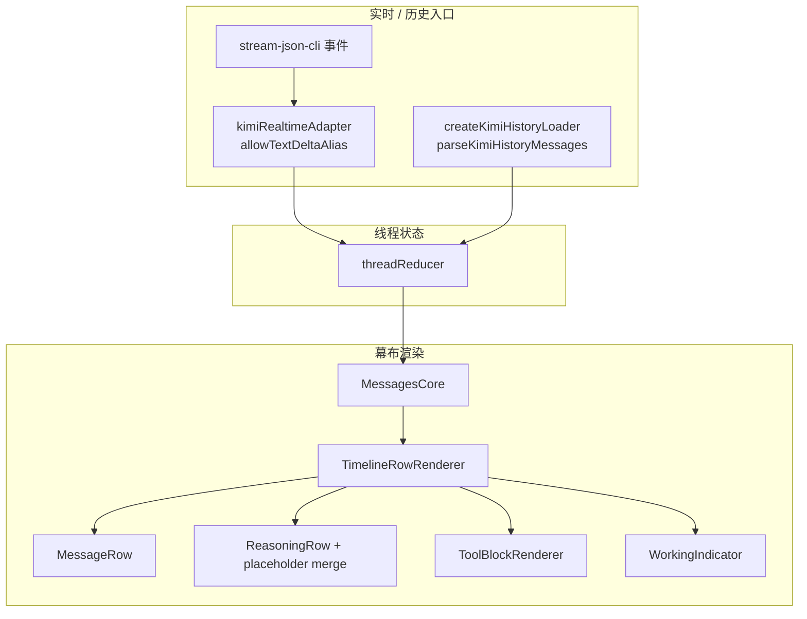

**Kimi 幕布特征**

- Shared Session 支持
- 渲染核与 grok/gemini 同类
- 差异主要在历史 parser 与 runtime 事件形态，不在 Row 组件树

### 5.6 OpenCode

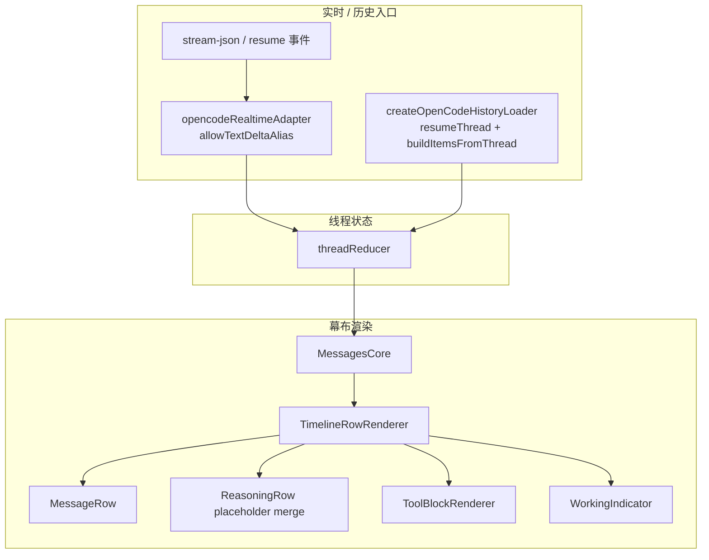

**OpenCode 幕布特征（校准后）**

- 历史不走本地 JSONL parser，而走 **resume thread 快照**
- `heartbeatWaitingHint` 写在 opencode profile 里，但 **默认 profile 关闭时该文案策略不生效**
- 支持 Shared Session
- activeCanvas **故意不**把 `heartbeatPulse` 选入 Messages props（避免 ~5s 心跳整树重渲）；心跳若要驱动 UI，应走 `conversationState.meta` 重建节奏

### 5.7 Shared Session（跨 CLI 单幕布）

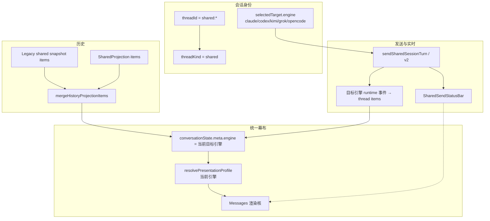

---

## 6. 对比矩阵

### 6.1 数据入口对比

| | Claude | Codex | Gemini | Grok | Kimi | OpenCode | Shared |
|--|--------|-------|--------|------|------|----------|--------|
| thread 前缀 | `claude:` | 默认/codex | `gemini:` | `grok:` | `kimi:` | `opencode:` | `shared:` |
| History loader | Claude JSONL | resume+local session | Gemini parser | Grok parser | Kimi parser | resumeThread | Shared loader |
| Realtime adapter | text delta alias | snapshot mode | text delta alias | 同左 | 同左 | 同左 | 走当前目标引擎 |
| Shared 可挂 | ✅ | ✅ | ❌ | ✅ | ✅ | ✅ | — |

### 6.2 幕布 UI 策略对比（默认运行态）

| 策略 | Claude | Codex | Gemini | Grok | Kimi | OpenCode | Shared 跟随 |
|------|--------|-------|--------|------|------|----------|-------------|
| 隐藏 bash 单卡 | ✅ | ✅ | ❌ | ❌ | ❌ | ❌ | 当前 engine |
| 隐藏 bashGroup | ✅* | ✅ | ❌ | ❌ | ❌ | ❌ | 当前 engine |
| 协作 badge | ❌ | ✅ | ❌ | ❌ | ❌ | ❌ | 仅目标=codex |
| staged lightweight MD | ✅ 硬编码 | ✅ 硬编码 | ❌ | ❌ | ❌ | ❌ | 当前 engine |
| activity command summary | ❌ | ✅ 硬编码 fallback | ❌ | ❌ | ❌ | ❌ | 目标=codex |
| reasoning live dot | ❌ | 仅 profile 开 | ❌ | ❌ | ❌ | ❌ | profile 开且 codex |
| heartbeat waiting hint | ❌ | ❌ | ❌ | ❌ | ❌ | 仅 profile 开 | profile 开且 opencode |
| docked live reasoning | 遗留路径默认关 | ❌ | ❌ | ❌ | ❌ | ❌ | 默认关 |
| fork provider 选择 | ❌ | ✅ | ❌ | ❌ | ❌ | ❌ | 当前 engine=codex |
| SharedSendStatusBar | ❌ | ❌ | ❌ | ❌ | ❌ | ❌ | ✅ 独有 |
| executionTarget 痕迹 | 少 | 少 | 少 | 少 | 少 | 少 | ✅ 投影字段 |

\* Claude 在 history transcript fallback 活跃时 bashGroup **可显示**。

### 6.3 组件树：共享 vs 差异

```text
【共享骨架 — 所有 CLI + Shared】
Messages
└─ MessagesCore
   ├─ MessagesLinkedRunBanner?
   ├─ MessagesAnchorRail?
   ├─ MessagesTimeline
   │  └─ TimelineProjectionViewport
   │     └─ TimelineRowRenderer × N
   │        ├─ MessageRow
   │        ├─ ReasoningRow
   │        ├─ ToolBlockRenderer → Bash/Read/Edit/Search/Mcp/Generic/...
   │        ├─ Read/Edit/Bash/Search ToolGroupBlock
   │        ├─ ReviewRow / DiffRow / ExploreRow / GeneratedImageRow
   │        ├─ WorkingIndicator
   │        ├─ empty / recovery / lightweight summary
   │        └─ slots: userInput / approval
   ├─ ScrollControl
   └─ PromptDistillDialog? 等交互层

【引擎/Shared 差异挂件（默认运行态）】
+ 引擎硬分支：bash 隐藏 / 协作 badge / staged MD(claude|codex)
+ SharedSendStatusBar（layout/composer 区，非 Messages 子树）
+ ProviderContinuationContextCard（timelineLeadingNode）
+ MessageForkConfirmDialog(showProviderSelector=codex)
+ presentationProfile(engine) —— 默认关
+ claudeDockedReasoning 投影行 —— 默认空（遗留门闩）
+ StatusPanel（layout sibling，活动摘要，非幕布行）
```

---

## 7. 逐组件梳理表（幕布内「都有什么」）

### 7.1 Orchestration / Timeline

| 组件/模块 | 路径 | 作用 |
|-----------|------|------|
| `Messages` | `components/Messages.tsx` | 兼容门面 |
| `MessagesCore` | `components/MessagesCore.tsx` | 状态编排、滚动、窗口、传 timeline |
| `MessagesTimeline` | `components/MessagesTimeline.tsx` | projection + virtualizer + row map |
| `TimelineProjectionViewport` | `timeline/components/…` | 视口/虚拟列表容器 |
| `TimelineRowRenderer` | `timeline/components/…` | 单行 kind 分发 |
| `ConversationRowErrorBoundary` | `components/conversation/…` | 行级错误隔离 |
| `ConversationLightweightPrompt` | `timeline/components/…` | 轻量模式提示 |
| `useMessagesTimelineModels` 等 | `orchestration/hooks/…` | 派生 snapshot/live/runtime/presentation |

### 7.2 Row 级

| 组件 | 路径 | 作用 |
|------|------|------|
| `MessageRow` | `rows/components/MessageRow.tsx` | 用户/助手主气泡 |
| `ReasoningRow` | `rows/components/ReasoningRow.tsx` | 思考过程 |
| `WorkingIndicator` | `rows/components/WorkingIndicator.tsx` | 底部运行态 |
| `ReviewRow` | `rows/components/PresentationRows.tsx` | Review 卡 |
| `DiffRow` | 同上 | Diff 卡 |
| `ExploreRow` | 同上 | Explore 卡 |
| `GeneratedImageRow` | 同上 | 生成图卡 |
| `TurnFilesChangedCard` | `components/conversation/…` | 回合文件变更 |

### 7.3 Tool Blocks

| 组件 | 作用 |
|------|------|
| `ToolBlockRenderer` | 分发器 |
| `BashToolBlock` / `BashToolGroupBlock` | 命令执行 |
| `ReadToolBlock` / `ReadToolGroupBlock` | 读文件 |
| `EditToolBlock` / `EditToolGroupBlock` | 编辑 |
| `SearchToolBlock` / `SearchToolGroupBlock` | 搜索 |
| `McpToolBlock` | MCP 调用 |
| `GenericToolBlock` | 兜底 + ExitPlanMode + fileChange 等 |
| `RequestUserInputSubmittedBlock` | 已提交的用户输入工具结果 |
| `ExitPlanToolContent` / `FileChangeToolContent` / `ImageViewToolContent` | Generic 内嵌内容 |

### 7.4 Context / Media / Recovery

| 组件 | 作用 |
|------|------|
| `CollapsibleUserTextBlock` | 用户长文折叠 |
| `IntentCanvasContextSummaryCard` | 意图画板上下文摘要 |
| `NoteCardContextSummaryCard` | 笔记卡上下文 |
| `ConversationBrowserContextSummaryCard` | 浏览器上下文 |
| `MessageMediaBlocks` / `LocalImage` | 图片网格与本地图 |
| `RuntimeReconnectCard` | 断线恢复 |
| `Markdown` | 统一 Markdown 渲染入口 |

### 7.5 Shared-only chrome

| 组件 | 作用 |
|------|------|
| `SharedSendStatusBar` | 发送态 / 恢复 / 目标不可用 |
| `ProviderContinuationContextCard` | 续聊来源会话 |
| Shared projection `dataSource` | 投影 → ConversationItem（非 UI 组件，但是幕布数据源） |

---

## 8. 端到端：从打开线程到像素

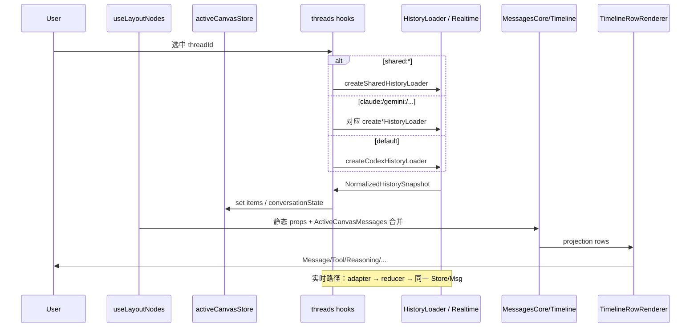

---

## 9. 与历史文档的关系

仓库内旧文：

- `docs/markdown-doc1-claude-chat-canvas-rendering.md`
- `docs/markdown-doc2-codex-chat-canvas-rendering.md`
- `docs/chat-canvas-conversation-curtain-contracts.md`

本分析相对它们的增量：

1. 覆盖 **gemini / grok / kimi / opencode / shared**（旧文主要 Claude/Codex）。
2. 对齐当前架构分层：`Messages` 门面 + `MessagesCore` + `TimelineRowRenderer`（旧文大量行号指向已拆分的 `Messages.tsx` 巨石时代）。
3. 明确 **Shared Projection DataSource** 与 **SharedSendStatusBar** 对幕布的作用边界。
4. 契约 kinds 已含 `generatedImage`。
5. **二次校准**修正了旧文/初版中的默认开关误判：normalized realtime 现默认 true；presentationProfile 默认 false；Claude dock 非默认路径。

契约权威定义仍以 `conversationCurtainContracts.ts` + `docs/chat-canvas-conversation-curtain-contracts.md` 为准；UI 组件树以本文 §2 / §7 为准；**默认运行态行为以 §4.0 / §12 为准**。

---

## 10. 检查清单（给你 review 用）

- [ ] 是否认同「渲染核统一；差异分 L1 数据 / L2 硬分支 / L3 profile（默认关）」？
- [ ] bash 隐藏 + Status Panel 承接活动，是否仍是产品预期的「幕布干净度」策略？
- [ ] Gemini 继续排除 Shared，是否 intentional product gap 还是技术债？
- [ ] `chatCanvasUsePresentationProfile=false`：继续当实验开关，还是该升默认 / 或删死代码？
- [ ] Claude docked reasoning 遗留路径：恢复产品能力 vs 删除死代码？
- [ ] Shared V2 发送九态是否需要独立 runbook（本文只到 StatusBar 边界）？
- [ ] Outline floater 长期关闭是否同步产品文档？

---

## 11. 关键源码索引

| 主题 | 路径 |
|------|------|
| 幕布门面 | `src/features/messages/components/Messages.tsx` |
| 编排核心 | `src/features/messages/components/MessagesCore.tsx` |
| 时间线 | `src/features/messages/components/MessagesTimeline.tsx` |
| 行分发 | `src/features/messages/timeline/components/TimelineRowRenderer.tsx` |
| 工具分发 | `src/features/messages/components/toolBlocks/ToolBlockRenderer.tsx` |
| 消息行 | `src/features/messages/rows/components/MessageRow.tsx` |
| Profile | `src/conversation-presentation/presentationProfile.ts` |
| Staged MD 判定 | `src/features/messages/rows/presentation/messagesStreamingComplexity.ts` |
| Canvas 挂载 | `src/features/layout/hooks/conversationCanvasNode.tsx` |
| Active canvas | `src/features/layout/hooks/activeCanvasStore.ts` |
| Layout 组装 | `src/features/layout/hooks/useLayoutNodes.tsx` |
| 设置默认值 | `src/features/settings/hooks/useAppSettings.ts` |
| Claude thinking 硬编码 | `src/app-shell-parts/useAppShellClaudeThinkingSection.ts` |
| Loader 工厂 | `src/features/threads/hooks/useThreadActions.historyLoaderFactory.ts` |
| Shared 历史 | `src/features/threads/loaders/sharedHistoryLoader.ts` |
| Shared 投影 | `src/features/messages/presentation/sharedProjection/dataSource.ts` |
| Shared 引擎集 | `src/features/shared-session/utils/sharedSessionEngines.ts` |
| Realtime 注册表 | `src/features/threads/adapters/realtimeAdapterRegistry.ts` |
| Migration gates | `src/features/threads/assembly/conversationMigrationGates.ts` |
| 契约 | `src/features/threads/contracts/conversationCurtainContracts.ts` |
| Engine 列表 | `src/features/engine/engineIds.json` |

---

## 12. 二次校准 Review（换角度）

> 视角：不是「组件清单是否全」，而是 **用户默认会看到什么**、**文档是否把死路径写成了现网行为**、**架构边界是否被画糊**。

### 12.1 校准方法

| 维度 | 做法 |
|------|------|
| **默认运行态** | 读 settings 默认值与 AppShell 硬编码，不以「代码存在」当「默认开启」 |
| **边界切割** | 区分 Messages 幕布 / Status Panel / Composer / Shared chrome |
| **能力分层** | L1 数据入口 · L2 引擎硬分支 · L3 profile/flag 增强 · L4 遗留死路径 |
| **共享会话** | 验证引擎白名单、projection 默认、发送条与时间线是否同树 |
| **历史文档漂移** | 对照 `markdown-doc1/2` 的开关默认值与行号时代结构 |

### 12.2 已修正的偏差（初版 → 校准）

| 主题 | 初版表述 | 校准后事实 | 证据 |
|------|----------|------------|------|
| presentationProfile | 像「各引擎默认差异表」 | **默认关**；多数字段不生效 | `chatCanvasUsePresentationProfile: false` |
| staged MD | 偏 codex profile | **claude + codex 硬编码** 开启 | `shouldUseStagedStreamingMarkdown` |
| Claude docked reasoning | 「强 reasoning dock」 | **默认空**；需 thinkingVisible 非 boolean + hide flag | `MessagesCore` + `claudeThinkingVisible=true` |
| normalized realtime | 旧文偏 legacy 默认 | **默认 true** | `useAppSettings` |
| unified history | 旧文有时写条件 | **默认 true** | 同上 |
| bash 隐藏后果 | 只说幕布不显示 | 活动多由 **Status Panel sibling** 承接 | `useLayoutNodes` StatusPanel |
| opencode heartbeat hint | 写成现网特征 | 仅 profile 打开时 | profile 默认 null |
| 差异总判断 | 「主要在 loader/adapter/profile」 | 改成 **L1+L2 为主，L3 默认休眠** | §0 / §4 |

### 12.3 仍成立的主判断

1. **渲染核确实统一**——多 CLI 不是多套 Messages UI。
2. **Shared 是 thread kind，不是第七套 Row 树**——差异在数据源与发送 chrome。
3. **Gemini 不在 Shared 白名单**——代码明确排除。
4. **流式性能策略**——尾窗 + live-text externalization + staged MD；流式期虚拟化故意关。

### 12.4 架构张力（风险面，非 bug 列表）

| 张力 | 说明 | 为什么重要 |
|------|------|------------|
| **双轨策略配置** | 硬编码引擎分支 vs presentationProfile vs migration gates vs localStorage flags | 新人无法从单一表读懂「默认行为」；改一处易漏另一处 |
| **藏工具 vs 找工具** | Claude/Codex 幕布藏 bash，Status Panel 另述 | 信息架构正确则干净；文档/引导不足则「命令跑了但幕布没卡」被当成丢事件 |
| **Profile 休眠代码** | profile 字段与 resolve 逻辑仍维护，但默认关 | 维护成本持续支付，用户价值未默认兑现 |
| **遗留 dock 门闩** | dockedReasoning 投影/渲染仍在，条件几乎不可达 | 增加理解成本与测试矩阵噪声 |
| **引擎体验分裂** | gemini/grok/kimi/opencode 幕布更「原貌」；claude/codex 更「产品化」 | 多 CLI 战略下一致性债务会放大 |
| **Shared 与 native 保真** | projection merge + target 切换 + engineSource 徽章 | 切引擎后历史语义是否可解释，是信任核心 |

### 12.5 文档使用边界

- 本文是 **结构 / 渲染面 / 默认运行态** 分析，不是完整 realtime event dictionary。
- Shared V2 九态、各 loader 字段级解析细节，应另开 runbook。
- 性能数字以 `docs/perf/**` 实测为准，不把本文当 perf baseline。

---

## 13. 后续建议与执行计划

> 原则：**先校准「事实源与默认行为」**，再收敛 **体验一致性**，最后才是 **能力扩展**。  
> 目标不是再加一层抽象，而是让「改幕布行为」变成可预测、可验收、可回滚的工程。

### 13.1 目标状态（North Star）

```text
单一渲染核（已有）
  + 单一「引擎呈现策略表」（可执行 contract，默认即真相）
  + Shared 只做数据/发送 orchestration，不分叉 Row 树
  + 活动信息有明确信息架构：幕布（叙事） / Status Panel（操作痕迹） / Composer（输入）
  + 新 CLI 接入 = adapter + loader + 策略行，而不是复制 Messages 分支
```

### 13.2 建议路线图（分波次）

#### Wave A — 事实源收敛（1–2 周，低风险高杠杆）

| 动作 | 为什么 | 好处 | 验收 |
|------|--------|------|------|
| **A1. 建立「默认运行态矩阵」进 trellis/spec 或 openspec contract** | 当前行为散落在 settings 默认、硬编码 `if engine`、profile、localStorage | 评审/排障不再猜 flag；AI/人类改代码有 single source of truth | 矩阵覆盖 6 engine + shared；每行标注代码锚点 |
| **A2. 标注或删除 Claude docked reasoning 死路径** | 条件默认不可达，却仍在 projection/renderer | 降认知噪声；测试不必维护无效分支 | 要么有产品开关可达，要么删除/ behind debug flag |
| **A3. 明确 presentationProfile 产品决策** | 默认关但代码在养 | 二选一：**(i)** 默认开启并补回归；**(ii)** 把硬编码能力下沉/上浮后删 profile 冗余 | 默认用户路径上 profile 行为可解释 |
| **A4. 文档退役/改写 markdown-doc1/2 默认开关** | 旧文 realtime 默认 false 等已漂移 | 避免后续 agent/同学被旧文带偏 | 旧文加 supersede 链接到本文 |

**为什么先做 Wave A：**  
任何体验统一、新 CLI 接入、Shared 扩引擎，若默认行为仍「口头约定」，都会把错误复制放大。先把 **truth table** 钉死，后续 diff 才可审查。

#### Wave B — 信息架构与一致性（2–4 周）

| 动作 | 为什么 | 好处 | 验收 |
|------|--------|------|------|
| **B1. 产品定义：幕布 vs Status Panel 职责** | Claude/Codex 藏 bash 是正确性能/噪音策略，但缺叙事 | 用户理解「命令去哪了」；减少误报 bug | 短文案/空态/面板入口一致；手动测 2 engine |
| **B2. 引擎呈现策略表（Capability × Presentation）** | 现有硬分支是隐式产品决策 | 新引擎不用复制 `if (engine===)`；共享会话切引擎体验可预期 | 表驱动（或至少中心模块）替代散落 if；有 contract 测试 |
| **B3. Shared 切引擎时的 turn badge / engineSource 可读性** | Shared 价值是跨 CLI；痕迹不清就失去信任 | 用户知道「这一轮是谁跑的」 | 投影字段在 MessageRow/Turn badge 有稳定呈现与单测 |
| **B4. Gemini Shared 决策** | 白名单排除可能 intentional 或遗漏 | 明确 gap：要么接入（loader+send+probe），要么产品文案写清「不支持」 | 决策记录 + UI disable 原因 |

**为什么 Wave B：**  
多 CLI 战略的用户感知不在「能不能跑」，而在 **叙事一致**。幕布是叙事层；Status Panel 是痕迹层；Shared 是跨引擎编排层。三层职责清，才不会互相塞 UI。

#### Wave C — 性能与可维护性加固（并行/穿插）

| 动作 | 为什么 | 好处 | 验收 |
|------|--------|------|------|
| **C1. 保持流式「尾窗优先、虚拟化后置」** | 流式虚拟化默认关是有意的 | 避免 bottom-follow 抖动回归 | 不轻易打开 streaming virtualization 除非有新 evidence |
| **C2. 把 staged MD 策略从引擎名解耦** | 现 `claude\|\|codex` 硬编码 | 新引擎可声明 `streamingPresentation: staged` | profile 或 capability 字段 + 测试 |
| **C3. Shared projection / V0 merge 可观测性** | merge 失败会 silent warn + fallback | 排障可定位「投影挂了还是 legacy 空」 | 诊断面板或 renderer diagnostic 计数 |
| **C4. 行级 ErrorBoundary 覆盖率盘点** | 已有边界，需确认重 kind 都罩住 | 单卡炸不拖垮整幕布 | 各 kind 注入故障用例 |

**为什么 Wave C：**  
幕布是热路径。任何一致性重构若不同时守住 **流式帧预算**，会把「架构正确」做成「体感变卡」。C 波次是护栏，不是炫技。

#### Wave D — 可选扩张（按产品优先级，不默认启动）

| 动作 | 触发条件 | 好处 |
|------|----------|------|
| D1. Shared 接入 Gemini | 产品确认需求 + runtime 可 probe | Shared 覆盖完整 builtin 集 |
| D2. Outline floater 恢复 | 长对话导航痛点数据 | 大纲导航体验 |
| D3. 流式期虚拟化实验 | 尾窗仍不够 + 有 jank evidence | 超长会话内存/DOM 下降 |
| D4. 统一 history parser 族收敛 | gemini/grok/kimi 重复维护痛 | 降低 loader 分叉成本 |

### 13.3 建议的「不做」清单

| 不做 | 原因 |
|------|------|
| 为每个 CLI 再拆一套 Messages UI | 已证明统一核可行；再拆会指数放大修复成本 |
| 在未校准默认行为前大开 presentationProfile | 行为突变面大，且与硬编码策略可能双写冲突 |
| 把 Status Panel 内容硬塞回幕布「为了对称」 | 会破坏 Claude/Codex 噪音控制与滚动性能 |
| 仅靠「文档同步」不做 contract 测试 | 多引擎默认行为会再次漂移 |

### 13.4 建议 Owner 切分

| 角色 | 负责 |
|------|------|
| **产品 / 设计** | 幕布 vs Status Panel 信息架构；Shared 引擎支持矩阵文案 |
| **Frontend messages** | 策略表落地、死路径清理、staged MD 解耦 |
| **Shared session** | projection 可观测性、切引擎 badge、V2 状态条与幕布边界 |
| **Perf** | 流式尾窗 / live-text / 虚拟化门禁的 evidence gate |

### 13.5 最小可启动任务包（若只做一件事）

**推荐启动包：`Wave A1 + A3 决策 + B1 一页信息架构`**

1. 输出可执行的默认运行态矩阵（engine × 行为 × 代码锚点 × 是否默认开）。  
2. 对 presentationProfile 做 go/no-go 产品决策（开默认 or 收敛删除）。  
3. 写清「命令/工具痕迹在 Status Panel，叙事在幕布」的用户语言。

**为什么这是最小包：**  
三天内就能消掉最大的「文档/代码/体感」三角债；不写新功能也能显著降低后续所有幕布相关 PR 的回归概率。

### 13.6 成功度量（建议）

| 指标 | 含义 |
|------|------|
| **策略单测覆盖** | 每个 engine 至少 1 条「bash 显隐 / staged MD / collaboration badge」断言 |
| **Shared 投影失败可观测** | 诊断计数或用户可见 degraded 提示，而非仅 console.warn |
| **文档漂移** | 旧 canvas 文档带 supersede；agent 最小读取路径指向本文或 contract |
| **体感不回退** | 长对话流式 jank 不劣于现有 perf 基线（引用 `docs/perf` 闸门，不新发明数字） |

---

*本文档为结构与渲染面分析 + 二次校准 + 后续计划；不含实现变更。*
