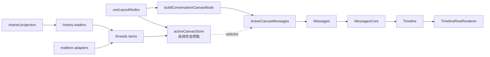

# 对话幕布结构（多 CLI + 共享会话）

> **对照源码日期**：2026-08-01（基于当前工作树；含历史展开 + **详情延迟/渲染详情** 专节）  
> **范围**：中心对话区（幕布 / Messages 时间线）  
> **用途**：后续 **统一幕布** 与 **幕布功能修复/优化** 的工作底稿  
> **任务 PLAN**：`docs/plans/2026-08-01-unified-conversation-canvas-architecture.md`（砍轻量 / 锚点 / 多 CLI 统一）  
> **滚动重构 DESIGN**：`docs/plans/2026-08-01-conversation-canvas-scroll-ownership-architecture.md`（层级权限 / Single Writer / **A 飞顶 + F 结束离真底** / 间歇性非长短；非止血）  
> **实现 Review**：`docs/analysis/unify-conversation-canvas-review-2026-08-01.md`  
> **过程投影矩阵**：`docs/analysis/canvas-live-tool-projection-matrix-2026-08-01.md`  
> **不在本文**：Intent 画板、底部 Status Panel 内部实现、Composer 输入框细节、完整 realtime 事件字典、perf 绝对数字（见 `docs/perf/**`）  
> **事实源**：`src/features/messages/**`、`layout/hooks/**`、`threads/**`、`shared-session/**`、`conversation-presentation/**`、`live-canvas/**`  
> **契约旁路**：`docs/chat-canvas-conversation-curtain-contracts.md` + `threads/contracts/conversationCurtainContracts.ts`（契约文若落后，以源码为准）

---

## 0. 怎么读（按角色）

| 你要… | 优先章节 |
|--------|----------|
| 30 秒搞清全局 | §1 结论 + §2 术语 |
| 统一架构 / 收敛引擎差异 | §1、§5、§6、§10 |
| 修功能 bug（工具卡/折叠/footer） | §3C、§8、§9 |
| 修滚动/流式卡顿 | §3A、§7、§7.1、§7.2、§9 |
| **「显示更早 / 历史展开」与锚点** | **§7.1** |
| **「详情已延迟 / 渲染详情」**（对话/行级已下线；块级显示详情保留） | **§7.2** |
| **Grok 实时看不到读/写文件卡** | **§5.1** |
| 改 Shared 历史/发送观感 | §6、§9 |
| 改代码从哪进 | §11 源码索引 |

**原则**：代码存在 ≠ 默认开启。以 settings 默认值 + AppShell 硬编码 + 无 flag 的 hard branch 为准。

---

## 1. 结论（默认运行态）

| 点 | 事实 | 大白话 |
|----|------|--------|
| **一套 UI 核** | 所有 native CLI + Shared 都走 `Messages → MessagesCore → MessagesTimeline → TimelineRowRenderer` | 不是 6 套聊天窗口，是一套窗口接不同水管 |
| **差异三层** | **L1 数据入口**最大；**L2 引擎硬分支**常驻；**L3 presentationProfile 默认关** | 真差别在「数据从哪来 + 写死的 if」；配置表大多在休眠 |
| **Shared 不是第七套 Row** | `threadKind=shared`，`threadId` 前缀 `shared:`；多的是历史投影 + 发送条 | 同一张画布，多了「换引擎跑」和发送状态条 |
| **Shared 引擎白名单** | `claude / codex / kimi / grok / opencode`（**无 gemini**） | Gemini 进不了共享会话 |
| **Settings 三开关** | normalized realtime=`true`；unified history=`true`；presentationProfile=`false` | 新实时/新历史默认开；「引擎皮肤表」默认关 |
| **Claude/Codex 幕布更「干净」** | bash/command 卡默认藏；活动多在 **Status Panel**（同屏兄弟，不在 Messages 树） | 命令跑了，幕布可能没卡——去底下状态面板找 |
| **文件修改场景** | 连续 edit + fileChange → `editGroup`（单条也成组）；**默认折叠**；展开才解析 diff | 一堆改文件合成「文件修改（N 个）」，先收着 |
| **流式 vs 闲时性能** | 流式：尾窗 60 + live-text 外置 + staged MD；**不**虚拟化。闲时：≥约 48 行可虚拟化 | 打字中只画尾巴；聊完了长历史才开虚拟列表 |
| **Grok 实时工具进幕布** | stdout 仍无 tool 事件；**live 桥接**：轮询 `chat_history.jsonl` 把 `tool_calls`/`tool_result` emit 为 Tool*（unify-conversation-canvas Phase D） | Kimi/OpenCode 本就有 live Tool*；Grok 用 history 桥补齐过程 |
| **历史呈现展开（Presentation Expansion）** | 把「只渲一部分 items」切到「全量 history」；`showAllHistoryItems` + `presentationMode=*-expanded-history-*` | 点「显示更早」/ 跳旧消息；**不是**截图里的「详情已延迟」 |
| **闲时数量折叠几乎关着** | `VISIBLE_MESSAGE_WINDOW=10000`（A2 有意）；**流式尾窗仍开** `STREAMING_VISIBLE_WINDOW=60` | 日常闲时很少看到「显示更早」；**流式中**更易看到折叠指示器 |
| **对话/行级轻量摘要墙** | **已下线（unify-conversation-canvas）**：policy/mode 恒 inactive；行级「详情已延迟」条不再渲染 | 见 §7.2；**块级「显示详情」仍保留** |
| **块级重型延迟** | Markdown 大表 / 工具重 output 仍可「显示详情」 | 与行级摘要墙分离 |
| **终轮 footer** | 助手 `isFinal` 行可挂 final boundary meta（完成时间 / 耗时 / token） | 回合结束有轻量汇总，不靠再挂一层独立卡 |

---

## 2. 术语（专业词 · 大白话）

| 词 | 意思 |
|----|------|
| **幕布 / Conversation Canvas** | 中间那条消息时间线；不是意图画板，也不是底栏状态面板 |
| **渲染核** | Messages 这一套 React 树；谁发消息都往这画 |
| **ConversationItem** | 时间线条目统一模型：`message / reasoning / tool / review / diff / explore / generatedImage` |
| **projection（投影行）** | 条目再加工成「要画的行」：工具分组、工作中指示、空态、审批槽位等 |
| **loader（历史加载器）** | 打开会话时，按 `threadId` 前缀把磁盘/服务端历史读进 items |
| **realtime adapter（实时适配器）** | 把引擎事件翻译成统一 item 变更，写进 reducer |
| **hard branch（引擎硬分支）** | 代码里 `if (engine === "codex")` 这类，不依赖开关也生效 |
| **presentationProfile** | 按引擎挂的「呈现皮肤」表；**默认关**，别当现网行为表 |
| **staged MD** | 流式时用轻量 Markdown 分阶段刷，少卡顿（claude+codex **硬编码**开启） |
| **live-text externalization** | 流式正文走 `liveAssistantTextChannel` 旁路，不全塞进 reducer 每字一次 |
| **virtualization（虚拟列表）** | 只挂载视口附近 DOM；闲时开，流式默认关 |
| **fileEdit 场景** | 改文件工具合成一张「文件修改」卡，默认折叠 |
| **final boundary meta** | 助手终轮 footer 旁的完成时间 / 耗时 / token 文案 |
| **settle-repin** | 回合结束 live 尾窗回刷全量后，在预算窗口内把视口钉回底部 |
| **历史呈现展开 / Presentation Expansion** | 历史窗口从「折叠/尾窗」切到「全量 items」；`showAllHistoryItems` + `historyExpansionMode`（§7.1） |
| **presentationMode** | 历史可见集模式：`realtime/static` × `collapsed/expanded/full` × `manual/jump`（§7.1） |
| **presentationScopeKey** | mode + 折叠计数 + 首尾 item id 拼出的 scope；变了等于换了一套可见集 |
| **historyExpansionMode** | 历史展开原因：`manual`（显示更早）或 `jump`（跳旧锚） |
| **live 尾窗** | 流式只保留近端约 `STREAMING_VISIBLE_WINDOW*2` 条 |
| **行内展开（in-row expand）** | 单卡内部折叠打开（fileEdit / explore 等）；不是 presentationMode |
| **⚠️ 详情延迟 / deferred hydration** | heavy 行先以 **summary** 占位（文案「详情已延迟」），点「渲染详情」再 hydrate 完整 DOM（§7.2） |
| **renderWeight / 渲染权重** | 按行估算渲染成本；`≥ TIMELINE_VIRTUALIZATION_HEAVY_ROW_WEIGHT(16)` 记为 heavy row |
| **conversation lightweight mode** | 对话级轻量策略：建议/强制把 heavy 行压成摘要条；oversized 可自动开 |
| **hydration mode** | 行级：`static` / `summary` / `hydrated`；`deferred` 时 UI 走摘要条 |
| **Shared Session** | 一个会话里可切换执行引擎；历史可 merge 投影 |
| **Hidden Binding** | Shared 背后的 native 绑定会话；**不进幕布**，也不应进侧栏当独立会话 |
| **chrome** | 幕布旁边的条/卡/对话框，不在时间线行里（如发送状态条、侧锚） |

---

## 3. 多角度：数据怎么变像素

### 3A. 挂载与数据面（Shell → 幕布）



| 层 | 文件 | 干什么（大白话） |
|----|------|------------------|
| Layout | `layout/hooks/useLayoutNodes.tsx` | 拼会话状态、是否 Shared、Composer 旁发送条 |
| Canvas 节点 | `layout/hooks/conversationCanvasNode.tsx` | 挂 Messages + fork 对话框；**不选 heartbeatPulse**，防 5s 心跳整树重渲 |
| 高频旁路 | `layout/hooks/activeCanvasStore.ts` | items / thinking / approvals 不走 Shell 大 props 树 |
| 门面 | `messages/components/Messages.tsx` | 旧 props 适配 → Core |
| 编排 | `messages/components/MessagesCore.tsx` | 窗口、滚动、runtime、交给 Timeline |
| 时间线 | `messages/components/MessagesTimeline.tsx` | 投影 +（可选）虚拟列表 + 逐行渲染 |
| 行分发 | `timeline/components/TimelineRowRenderer.tsx` | kind → 具体气泡/工具卡 + final boundary footer |

**统一幕布提示**：任何「多引擎各挂一套 Messages」的方案，都会与 `activeCanvasStore` 旁路 + Shell 节点契约冲突；收敛应发生在 **L1 水管 / L2 策略表**，不是再长一棵树。

### 3B. 渲染管线（一份，勿重复画）

```text
ConversationItem[]
  → 过滤 / 去重 / 流式尾窗 / 折叠中间步骤
  → groupToolItems()
       read|bash|search：连续 ≥2 成组
       fileEdit：edit|write + fileChange 归并，≥1 即成 editGroup
  → buildTimelineProjectionRows()
       entry | workingIndicator | emptyState | approval | …
  → TimelineRowRenderer（外包 ConversationRowErrorBoundary）
```

| 步骤 | 路径 |
|------|------|
| 分组 | `messages/utils/groupToolItems.ts` |
| 投影 | `timeline/projection/messagesTimelineProjection.ts` |
| 行分发 | `timeline/components/TimelineRowRenderer.tsx` |
| 契约 kinds | `threads/contracts/conversationCurtainContracts.ts` |
| 流式尾窗 | `orchestration/presentation/messagesLiveWindow.ts` + `STREAMING_VISIBLE_WINDOW` |

**editGroup 投影 identity**：`getGroupedEntryProjectionKey` 对 `editGroup` **只用 firstId**。  
streaming 时文件数增长若写入 lastId/length，会 remount 并丢掉用户展开态——修「折叠莫名重置」先看这里。

### 3C. kind → 组件 · 分组 · chrome 边界

| kind | 组件 | 备注 |
|------|------|------|
| `message` | `MessageRow` | 用户/助手主气泡；流式可走 live-text；终轮可有 action footer |
| `reasoning` | `ReasoningRow` | 思考；Claude dock 路径默认空 |
| `tool` | `ToolBlockRenderer` 或 Group | 可被引擎策略隐藏 |
| `review` / `diff` / `explore` / `generatedImage` | `PresentationRows` 等 | 评审 / diff / 探索 / 图 |

**工具分发（单卡）**：`ToolBlockRenderer` — userInput 结果 → ExitPlan → bash → read → edit → search → MCP → Generic。  
**常态改文件**：多进 `EditToolGroupBlock`（默认折叠），不常落单卡 `EditToolBlock`。

**分组卡**

| 组 | 组件 | 策略 |
|----|------|------|
| `readGroup` | `ReadToolGroupBlock` | ≥2 连续 |
| `editGroup` | `EditToolGroupBlock` | fileEdit 桶；≥1；**默认折叠**；同 path 留最后一次；展开再算 diff |
| `bashGroup` | `BashToolGroupBlock` | codex 全藏；claude 非 transcript-fallback 时藏 |
| `searchGroup` | `SearchToolGroupBlock` | ≥2；MCP `search_query` 故意不组 |

另：`TodoWrite` / `todo_write` 在分组前剔除（`shouldHideToolItemForRender`）。

**非 item 行（时间线补丁）**：`workingIndicator`、`tailUserInput` / `approval`、`liveMiddleCollapsed`、`emptyState` / `historyRecoveryFailure`、`bottomAnchor`、`dockedReasoning`（**默认死路径**）。

**MessageRow 常挂子面**：用户长文折叠、记忆/笔记/Intent/浏览器上下文摘要、协作 badge（仅 codex）、图片、任务输出检查器、断线恢复卡。

**周边 chrome（同屏非时间线行）**

| 组件 | 说明 |
|------|------|
| `MessagesAnchorRail` | 侧栏跳用户消息（只预览 user，躲流式打穿） |
| `ScrollControl` | 贴底/跳转；含 turn-settle、scroll-echo 过滤 |
| `MessagesOutlineFloater` | 大纲；`SHOW_OUTLINE_FLOATER=false` 产品关 |
| `TurnFilesChangedCard` | 回合改文件摘要（与 final boundary 联动：末轮闲时由累计卡承载） |
| `MessageForkConfirmDialog` | fork；codex 可带 provider 选择 |
| `SharedSendStatusBar` | **仅 Shared**，Composer 上方 |
| `ProviderContinuationContextCard` | 续聊来源（`timelineLeadingNode`） |

**信息架构一句话**：幕布 = 叙事；Status Panel = 操作痕迹；Composer = 输入。  
藏 bash 不等于没跑命令——用户去 Status Panel 找。

---

## 4. 默认运行态矩阵

### 4.1 总开关

| 开关 | 默认 | 影响（大白话） | 锚点 |
|------|------|----------------|------|
| `chatCanvasUseNormalizedRealtime` | true | 实时事件走统一 adapter | `useAppSettings.ts` |
| `chatCanvasUseUnifiedHistoryLoader` | true | 历史走统一 loader 工厂 | 同上 |
| `chatCanvasUsePresentationProfile` | **false** | 引擎皮肤表休眠 | 同上 |
| Shared projection | true（可 localStorage / env 关） | Shared 历史默认可 merge 投影 | `sharedProjection/dataSource.ts` |
| `TIMELINE_ADAPTIVE_RENDERING_ENABLED` | true | 闲时虚拟化 / oversized 轻量模式总闸 | `messagesTimelineVirtualization.ts` |
| idle 虚拟化门槛 | 行数 ≥**48** 或 renderWeight ≥**96** | 长历史才开虚拟列表 | 同上 |
| `TIMELINE_VIRTUALIZATION_DURING_STREAMING_ENABLED` | **false** | 流式不用虚拟列表，用尾窗 | 同上 |
| `STREAMING_VISIBLE_WINDOW` | 60 | 流式只保留近端条目（约 `*2` 工作集） | `messagesRenderUtils.ts` |
| `VISIBLE_MESSAGE_WINDOW` | **10000** | 闲时数量折叠阈值（现网几乎关） | 同上 |
| `liveTextExternalization` | true（`ccgui.perf.liveTextExternalization=0` 回退） | 流式正文字走旁路 | `realtimePerfFlags.ts` |
| `claudeThinkingVisible` | true（AppShell 写死） | Claude 思考默认显示；dock 遗留门闩打不开 | `useAppShellClaudeThinkingSection.ts` |
| `SHOW_OUTLINE_FLOATER` | false | 大纲浮层关着 | `MessagesTimeline.tsx` |
| `SETTLE_REPIN_WINDOW_MS` | 2400 | 回合结束回刷后钉底预算 | `messagesConstants.ts` |
| `INITIAL_BOTTOM_PIN_BUDGET_MS` | 2400 | 打开会话后跟随预算 | 同上 |

### 4.2 presentationProfile（默认关）

路径：`conversation-presentation/presentationProfile.ts`。仅 `usePresentationProfile===true` 时 `resolvePresentationProfile` 生效。

| 字段 | 引擎意图 | 默认关时是否另有硬编码 |
|------|----------|------------------------|
| staged MD throttle | codex profile | **有**：claude+codex 恒 true（`shouldUseStagedStreamingMarkdown`） |
| preferCommandSummary | codex | **有**：WorkingIndicator 对 codex 仍偏命令摘要 |
| codexCanvasMarkdown / showReasoningLiveDot | codex | **无** |
| heartbeatWaitingHint | opencode | **无**（且 heartbeat 不经 ActiveCanvas 大 props） |

### 4.3 Claude dock 死路径（勿当产品能力）

```text
legacyClaudeReasoningDockEnabled =
  engine===claude
  && typeof claudeThinkingVisible !== "boolean"  // 现网是 boolean true → 永远 false
  && shouldHideClaudeReasoningModule()
```

---

## 5. 引擎硬分支矩阵（常驻，与 profile 无关）

| 行为 | Claude | Codex | Grok | 其他（gemini/kimi/opencode） | Shared |
|------|--------|-------|------|------------------------------|--------|
| 藏 bash 单卡 | ✅ | ✅ | ✅（对齐 Claude） | ✅ Kimi/OpenCode | 跟目标引擎 |
| **实时 tool 进幕布** | ✅ | ✅ | ✅ **jsonl 增量 tail 桥** | Kimi/OpenCode：stream Tool* | 跟目标 adapter |
| **历史 tool 进幕布** | ✅ | ✅ | ✅ jsonl | ✅ | 跟目标 loader |
| 藏 bashGroup | ✅* | ✅ | ✅ | ✅ | 同上 |
| 协作 badge | ❌ | ✅ | ❌ | ❌ | 目标=codex |
| staged MD | ✅ 硬编码 | ✅ 硬编码 | ❌ | ❌ | 跟目标 |
| 超长流式折叠 | ✅ | ❌ | ❌ | ❌ | 跟目标 |
| activity 偏命令摘要 | ❌ | ✅ | ❌ | ❌ | 目标=codex |
| Fork provider 选择 | ❌ | ✅ | ❌ | ❌ | 目标=codex |
| docked reasoning | 死路径 | — | — | — | — |
| SharedSendStatusBar | — | — | — | — | ✅ 独有 |
| Realtime 消息模式 | delta 别名 | **快照** | delta 别名 | delta 别名 | 跟目标 adapter |

\* Claude 在 history transcript fallback（极重历史且折叠后几乎没东西可画）时，bashGroup 可露出。  
\* Grok 的「幕布无读/写卡」**不是** `shouldHideCodexCanvasCommandCard` 式隐藏，见 **§5.1**。

### 5.1 Grok 实时对话：幕布上看不到「读文件 / 编辑文件」

> **产品现象（与截图对齐）**  
> 实时 Grok 回合中：幕布只有思考 + 助手正文（甚至一句 “I have enough context…”）；右侧 **Diff** 已出现文档改动（+250/-105）；底部/状态区可能有「正在写入…」。  
> 用户疑问：文件明明在改，为什么幕布没有 Read / Edit 工具卡？

#### 结论（先对齐文档）

| 问题 | 答案 |
|------|------|
| 和 §5「其他引擎 bash 原貌」矛盾吗？ | **不矛盾**。「原貌」= **有 tool item 就不藏**；Grok **live 根本没有 tool item 进 reducer**。 |
| 是「详情已延迟」吗？ | **否**。延迟前提是行已存在；截图是 **工具行从未挂上时间线**。 |
| 是 Status Panel 分流吗？ | **部分相关**：活动痕迹可在 Status/Diff 出现，但 Claude/Codex 仍会在幕布投 tool/fileEdit；Grok live **两者都不投 tool 行**。 |
| 历史里会有吗？ | **会**。`chat_history.jsonl` 的 `assistant.tool_calls` / `tool_result` 经 history loader 可变成 tool 行。 |

#### 因果链（L1 水管）— **2026-08-01 已接 jsonl 桥**

```text
Grok CLI headless streaming-json
  stdout 仍只有: text | thought | end | error
        │
        ├──► TextDelta / ReasoningDelta / TurnCompleted
        │
        └── 并行 poll chat_history.jsonl（每 ~200ms + 结束再 drain）
              tool_calls  → ToolStarted
              tool_result → ToolCompleted
                    │
                    ▼
              forwarder → item/started|completed
                    │
                    ▼
              幕布 kind=tool（read/fileChange 归场景）
```

| 层 | 路径 | 事实 |
|----|------|------|
| CLI stdout | `grok.rs` parse | 仍无 tool 行类型 |
| **Live 桥** | `grok.rs` tool poll + `grok_history::drain_new_tool_signals_*` | **补** ToolStarted/Completed |
| Kimi | `kimi.rs` stream 本就有 tool_calls | 已 emit；Completed 现带 tool_name |
| OpenCode | `opencode.rs` 本就有 Tool* | 不改协议 |
| FE | `buildConversationItem` mcpToolCall title 优先工具名 | 便于 read/edit 分组 |
| Diff 面板 | 工作区 git | 仍独立；与幕布 tool 可并存 |

#### 和 UI 三件套的分工（截图怎么读）

| 表面 | 实时 Grok 写文档时通常看到 | 含义 |
|------|---------------------------|------|
| **幕布** | 思考 + 短助手句；**无** readGroup/fileEdit 卡 | 无 live tool 投影 |
| **Diff 面板** | `docs/analysis/*.md` 等 +N/-N | **工作区文件变更**（git），不依赖幕布 tool item |
| **Status / 工作指示** | 「正在写入两篇文档」类文案 | 回合/任务态提示，**≠** 工具卡时间线 |

#### 与「能对上的文档」对照

| 文档已有表述 | 是否覆盖本现象 | 补丁 |
|--------------|----------------|------|
| §5 藏 bash 仅 Claude/Codex | ✅ 说明 **不是** 藏卡 | 已写清 |
| §5 Realtime 模式 Grok=delta 别名 | ⚠️ 只说文模式，**未写 tool 缺口** | **本 §5.1** |
| §3C tool 分发 / fileEdit 成组 | 前提是 **已有 tool item** | Grok live 到不了这一层 |
| §7.2 详情已延迟 | ❌ 不同问题 | 勿混用 |
| §9「命令跑了幕布没卡」 | 原先偏向 Claude/Codex→Status Panel | **补 Grok 行** |

#### 后续能力债（桥接之后）

| 优先级 | 项 | 说明 |
|--------|-----|------|
| **P2** | 延迟/抖动 | jsonl 轮询 200ms，工具卡略滞后于真实执行；可考虑 inotify |
| **P2** | stdout 原生 tool 类型 | 若 Grok CLI 日后 stdout 直接发 tool 事件，可双通道去重 |
| **P2** | 能力矩阵 codegen | `canvas.liveToolProjection`：grok=bridged-jsonl；kimi/opencode=stream |

**History 前缀路由**（`useThreadActions.historyLoaderFactory.ts`）：

| 前缀 | loader |
|------|--------|
| `shared:` | `createSharedHistoryLoader` |
| `claude:` | Claude JSONL + shadow |
| `gemini:` | Gemini（Claude 解析器族） |
| `grok:` / `kimi:` | 本引擎 parser |
| `opencode:` | `resumeThread` 快照（非本地 JSONL） |
| 默认 | Codex resume + 本地 session 融合 |

**Realtime 注册**：`threads/adapters/realtimeAdapterRegistry.ts` — 六引擎各一 adapter；codex = `agentMessageSnapshotMode: "snapshot"`，其余 `allowTextDeltaAlias: true`。

---

## 6. Shared Session（跨引擎单幕布）

| 项 | 值 | 大白话 |
|----|-----|--------|
| 身份 | `threadKind=shared`，`threadId` 以 `shared:` 开头 | 一看 id 就知道是共享会话 |
| 可执行引擎 | claude/codex/kimi/grok/opencode；非法回落 claude | 没有 Gemini |
| 当前目标 | `selectedTarget` / `selectedNextTarget`（下一次 Send） | 这一轮谁来跑 |
| 历史 | Legacy snapshot ⊕（可选）SharedProjection merge | 老快照 + 新投影拼在一起 |
| 发送 | sendStateMachine → runtime 事件进同一 items | 幕布仍只吃 ConversationItem |
| 额外 UI | SharedSendStatusBar；续聊来源卡 | 状态条在 Composer 上，不在时间线里 |
| Hidden Binding | 后台 native 绑定；侧栏/幕布不应当独立会话露出 | 修「多出来一行会话」看 summaries 过滤 |

历史路径（简）：

```text
shared:id → createSharedHistoryLoader
  → loadSharedSession（legacy）
  → [projection 开] loadSharedProjection → toSharedConversationItems
  → 有 legacy 则 merge，否则仅 projection
  → normalize → setThreadItems → activeCanvasStore → Messages
```

要点：

1. `sharedProjection/dataSource.ts` **不** import native `threadItems`（隔离）。
2. 投影丢弃 `systemNotice` / `metadata`（观测面，不进幕布）。
3. 消息可带 `engineSource` / `executionTargetSnapshot`（「这轮谁跑的」痕迹）。
4. UI 行组件与 native **完全同一套**。
5. 开关：`mossx.sharedProjection` / 旧 key `ccgui.sharedProjection` / `VITE_MOSSX_SHARED_PROJECTION`；Settings Other 区有测试回滚开关（改后 reload）。

**供应商/模型**（幕布旁 Composer 行为，细节见姊妹文）：Shared 切渠道只改 `selectedNextTarget`，不新建会话、不走 Native 续接。见 `docs/analysis/native-session-provider-select-vs-disk-overwrite-2026-07-31.md`。

---

## 7. 流式 / 闲时 / 性能旋钮

| 阶段 | 策略 | 目的 |
|------|------|------|
| 流式 | 尾窗裁剪 + static DOM；**不**开虚拟化 | 避免 virtualizer attach 把视口拽飞 / size cache 空 |
| 流式正文 | live-text 外置（默认开） | 减根 reducer 每 delta 重渲 |
| 流式 Markdown | claude/codex staged throttle | 少 full react-markdown 重解析 |
| 回合结束 | settle-repin 2.4s | 尾窗回全量后 scrollHeight 暴增仍贴底 |
| 打开会话 | initial bottom pin 2.4s | 虚拟化/测量收敛前跟底 |
| 闲时长历史 | rows≥48 或 weight≥96 虚拟化 | 降低全量 DOM 滚动成本 |
| 中间步骤 | live collapse middle（local flag） | 可选折叠中间输出 |
| 历史呈现展开 | 见 **§7.1** | 「显示更早」/ 跳旧消息打开全量 items |
| **⚠️ 详情已延迟** | 见 **§7.2** | heavy 行摘要条 +「渲染详情」；**重点重做** |

**改门槛前必回归**：`Messages.virtualized-jump`、scroll-echo、turn-settle 贴底、历史展开跳锚、**详情 hydrate 后锚点**。  
**perf 深读**：`docs/perf/render-jank-knife-experiments-2026-07-08.md`、`docs/perf/streaming-render-stall-design-2026-07-30.md`。  
**硬红线（AGENTS）**：高频 setState 禁挂根 hook 链；流式正文禁恢复逐 delta dispatch 进 reducer。

---

## 7.1 历史呈现展开（Presentation Expansion）与锚点

> **注意**：产品/用户口语里的「渲染展开」常指截图里的 **「详情已延迟 / 渲染详情」**，那是 **§7.2**。  
> 本节专指 **History Presentation Expansion**：从「只渲染一部分 ConversationItem」切到「全量 history」，`presentationMode` 含 `expanded-history`。  
> 也不等于单卡 fileEdit/explore 的 **行内展开**（§7.1.5）。

### 7.1.1 是什么

幕布并不是永远把 `items[]` 全挂 DOM。有两层「可见集」：

| 层 | 何时 | 默认阈值 | 效果 |
|----|------|----------|------|
| **闲时数量窗** | `!isThinking` | `VISIBLE_MESSAGE_WINDOW = **10000**` | 只在 item 数 >10000 时才切掉前缀；**现网几乎等价关闭数量折叠** |
| **流式尾窗** | `isThinking` | `STREAMING_VISIBLE_WINDOW = **60**`（working set ≈ `*2`） | 流式只渲近端；更早历史折叠进「显示更早」计数 |

状态机核心（`messagesLiveWindow.resolveMessagesPresentationMode`）：

| `presentationMode` | 含义（大白话） |
|--------------------|----------------|
| `realtime-collapsed-tail` | 流式中，历史被折叠，只画尾巴 |
| `realtime-full-tail` | 流式中，没折叠（条目不够长） |
| `realtime-expanded-history-manual` | 流式中，用户**手动**展开全历史 |
| `realtime-expanded-history-jump` | 流式中，为**跳旧消息**强制展开 |
| `static-collapsed-history` | 闲时，前缀被数量窗裁掉 |
| `static-full-history` | 闲时，全量（或不够裁） |
| `static-expanded-history-manual` | 闲时，手动展开后 |
| `static-expanded-history-jump` | 闲时，跳锚强制展开后 |

`showAllHistoryItems=true` 时，无论 realtime/static，mode 都会落到 `*-expanded-history-{manual|jump}`。

**presentationScopeKey**（`buildMessagesPresentationScopeKey`）把  
`scopeKey + mode + collapsedCount + itemCount + firstId + lastId` 拼成字符串。  
scope 一变 = 可见集换了一套；deferred presentation / virtualizer / 诊断都会按新 scope 处理。

### 7.1.2 为什么要这样

| 动机 | 说明 |
|------|------|
| **流式成本** | 全历史每帧协调 Markdown/工具卡 ≈ O(全长)；尾窗压到 O(近端)（`messagesRenderUtils` 注释） |
| **跟底稳定** | 流式跟底只关心尾部；中间历史不挂 DOM，少 layout thrash |
| **按需看旧文** | 需要旧上下文时再展开，而不是永远全量 |
| **与虚拟化分工** | 流式 **故意** 不开 `TIMELINE_VIRTUALIZATION_DURING_STREAMING`；展开后若闲时达标，再走 idle 虚拟化 |

A2 把 `VISIBLE_MESSAGE_WINDOW` 提到 10000，是**有意**弱化闲时「数量折叠」，避免和虚拟化/贴底抢策略（见 `Messages.virtualized-jump.test.tsx` skip 注释）。  
**结果**：现网「显示更早」更多出现在 **流式尾窗** 场景，而不是闲时 30 条就折叠。

### 7.1.3 怎么触发

```text
                    ┌─────────────────────────────────────┐
                    │  visibleCollapsedHistoryItemCount>0   │
                    │  → 顶部 .messages-collapsed-indicator  │
                    └──────────────┬──────────────────────┘
                                   │ 用户点击
                                   ▼
                         revealAllHistoryItems("manual")
                                   │
        ┌──────────────────────────┼──────────────────────────┐
        │                          │                          │
        ▼                          ▼                          ▼
 showAllHistoryItems=true   historyExpansionMode=manual   pending expansion
        │                          │                          │
        └──────────► presentationMode = *-expanded-history-manual
                     layoutEffect: scrollTop=0, autoScroll=false
```

| 触发 | 入口 | expansionMode | 展开后滚动意图 |
|------|------|---------------|----------------|
| **手动「显示更早」** | 点 `.messages-collapsed-indicator` → `handleShowAllHistoryItems` → `revealAllHistoryItems("manual")` | `manual` | **强制 `scrollTop=0`**（回到揭示后的历史头）；关 autoScroll |
| **跳旧锚点** | 侧栏 `MessagesAnchorRail` / `ccgui:jump-to-message` → `requestScrollToAnchor` | 若目标 DOM 不在（被裁掉）→ `revealAllHistoryItems("jump")` + `pendingJumpMessageId` | **不**先滚顶；等目标挂载后 `scrollTo` 平滑对准（视口约 28% 处） |
| **切会话 / firstItemId 变** | `useMessagesHistoryWindow` effect | 清空 expand 态 | 回到折叠策略（若仍适用） |
| **回合结束 settle** | 不是「history expand」 | — | live 尾窗回刷全量 + **settle-repin** 钉底（另一条高度暴涨路径） |

关键代码：

| 职责 | 路径 |
|------|------|
| 模式枚举 / 尾窗 | `orchestration/presentation/messagesLiveWindow.ts` |
| expand state | `orchestration/hooks/useMessagesHistoryWindow.ts` |
| 跳锚 + 先 expand | `orchestration/hooks/useMessagesAnchorNavigation.ts` |
| 手动 expand 后滚顶 | `MessagesCore.tsx` `useLayoutEffect(showAllHistoryItems)` |
| 指示器 UI | `MessagesTimeline.tsx` `.messages-collapsed-indicator` |
| 阈值常量 | `utils/messagesRenderUtils.ts` `VISIBLE_MESSAGE_WINDOW` / `STREAMING_VISIBLE_WINDOW` |

### 7.1.4 触发之后：锚点 / 滚动影响（重点）

展开 = **DOM 集合与 scrollHeight 阶跃变化**。影响面：

```text
showAllHistoryItems ↑
  → renderedItems 前缀突然接上
  → scrollHeight 暴涨（顶部插入大量像素）
  → messageNodeById 补齐旧 id
  → presentationScopeKey 变
  → activeAnchor 需 recompute
  →（若 jump）pendingJump 等节点 ready 再 scrollTo
  →（若 manual）scrollTop 置 0，用户离开底部
  → autoScroll 通常关闭 → 流式时若仍在生成，不再强制贴底
```

| 锚点/滚动对象 | expand 后行为 | 风险 / 症状 |
|---------------|---------------|-------------|
| **底部 follow（autoScroll）** | manual expand **关** autoScroll；jump 路径 `autoScroll=false` 后再滚到目标 | 流式中点「显示更早」后，新 delta **不再自动贴底**，直到用户再滚回底部附近 |
| **bottomAnchor 行** | 仍在 projection 末尾；manual 滚到顶后离开它 | 看起来像「展开后掉出最新消息」——预期，不是丢消息 |
| **用户消息侧锚 `MessagesAnchorRail`** | 只索引 user 锚；目标被裁时先 expand 再 jump | 旧锚点 expand 前 `querySelector` 为空；必须等 DOM；若 remeasure 慢会「点了半晌才跳」 |
| **pendingJumpMessageId** | jump expand 专用；`useMessagesTimelineVirtualizer` / layout 信号里 target ready 再滚 | 展开 + 虚拟化同时变时，size cache 空 → 第一次 scrollTop 算偏，依赖二次收敛 |
| **activeAnchorId** | expand 后 `scheduleAnchorUpdate("sync")` | 视口从尾部切到头部时，active 侧锚会从「最新用户句」切到「视口内旧句」 |
| **presentationScopeKey** | mode/count/首尾 id 变 → deferred presentation 可能丢旧 snapshot | 流式 readable-window recovery 依赖 scope 一致；跨 scope 不复用 deferred 列表 |
| **virtualizer remeasure** | 闲时展开后若过 idle 门槛，virtualizer attach + remeasure 预算 | remeasure 超预算被 suppress → 空白洞/重叠；见 hydration remeasure cooldown |
| **settle-repin（另一路径）** | 回合结束尾窗回全量，**不是** `showAllHistoryItems` | 同样 scrollHeight 暴涨，但意图是 **钉底**（2.4s 预算），与 manual expand「滚顶」相反 |

**对照记忆**：

| 高度暴涨原因 | 用户意图 | 滚动策略 |
|--------------|----------|----------|
| 渲染展开 manual | 看更早历史 | **顶**（scrollTop=0） |
| 渲染展开 jump | 落到某条旧消息 | **目标锚**（smooth） |
| settle-repin / 尾窗结束 | 继续看最新 | **底**（stick window） |
| 行内展开（fileEdit…） | 看详情 | **尽量保 scrollTop**（无统一 pin；局部增高可能「顶上去」） |

### 7.1.5 行内展开（易混淆，单独说）

这些 **不改** `presentationMode`，但会改行高 → 影响视口内锚点相对位置：

| 行内展开 | 默认 | 锚点注意 |
|----------|------|----------|
| fileEdit / `EditToolGroupBlock` | **默认折叠**；展开才懒算 diff | streaming 时组 identity 只用 firstId，防 remount 丢展开态 |
| explore 卡 | thinking 时可能 auto-expand，结束后收 | 与 live auto-expand id 联动 |
| 用户长文 / 注解 / NoteCard 摘要 | 交互展开 | 局部增高；侧锚仍绑 message id |
| 代码块注解 | 交互展开 | 同上 |

排障时先分清：**是顶部「显示更早」类展开，还是某一张卡自己展开**。

### 7.1.6 现网体感（2026-08-01）

| 场景 | 会不会看到「渲染展开」 |
|------|------------------------|
| 闲时对话 <10000 items | **基本不会**（数量窗极宽） |
| 流式长对话 | **会**：指示器显示 omitted 计数；点开 = realtime-expanded-history-manual |
| 侧栏点很旧的用户句（目标不在尾窗） | **会**：jump expand，再滚到锚 |
| 回合结束 | 不是 history expand；是尾窗回刷 + settle-repin |

回归用例入口：`Messages.live-behavior.test.tsx`（expand before jump / reveal resets to head / reveal during streaming）、`messagesLiveWindow.test.ts`（mode 解析）、`Messages.virtualized-jump.test.tsx`（A2 折叠策略 skip 注释）。

---

## 7.2 重型行「详情已延迟 / 渲染详情」— 对话/行级 **已下线**；块级 **保留**

> **产品决策（2026-08-01 / unify-conversation-canvas）**  
> - **砍掉**：对话级轻量模式 UI、行级「详情已延迟 … 渲染权重」摘要条、「渲染详情」主路径  
> - **保留**：块级「重型 Markdown 详情已延迟 / 工具详情已延迟 + **显示详情**」  
> - 性能靠尾窗 + 闲时虚拟化 + live-text + 块级延迟  
>  
> **历史截图（已移除主路径）**  
> - ~~灰条：详情已延迟 · readGroup/助手消息 + 渲染详情~~  
> - ~~顶部：检测到重型对话 / 启用轻量模式~~  
> - **仍可能见到**：块级 `重型 Markdown 详情已延迟 · 表格 · N 行` + **显示详情**

### 7.2.1 是什么（三层，别混）

| 层 | 用户看到什么 | 代码态 | 现状 |
|----|--------------|--------|------|
| **A. 对话级轻量模式** | 顶部轻量条 | `resolveConversationLightweightModeState` | **恒 inactive**；Prompt 不展示 |
| **B. 行级 hydration 摘要** | 灰条 + 渲染详情 | `shouldRenderLightweightProjectionRow` | **恒 false**；不再 `mode=summary` 驱动 UI |
| **C. 块级 Markdown/工具延迟** | 「重型 Markdown… / 工具详情已延迟」+ **显示详情** | 行内 heavy island | **保留** |

**不是**：§7.1 历史「显示更早」、也不是 fileEdit 默认折叠。

### 7.2.2 为什么会这样

| 动机 | 机制 |
|------|------|
| 长对话 / 大 Markdown / 大 tool 输出 | 全量 hydrated DOM 会卡滚动与输入 |
| 用 **renderWeight** 估成本 | `estimateTimelineProjectionRenderWeight`；`≥16` = heavy（`TIMELINE_VIRTUALIZATION_HEAVY_ROW_WEIGHT`） |
| 虚拟化开启时 | 非可见 heavy 行可 `mode=summary` 延迟详情（`deriveTimelineRowHydrationStates`） |
| 对话 oversized / 用户点「启用轻量模式」 | 更多行强制走 lightweight 摘要 UI（`resolveConversationLightweightModeState`） |

阈值（默认，`TIMELINE_ADAPTIVE_RENDERING_ENABLED=true`）：

| 常量 | 值 | 作用 |
|------|-----|------|
| `TIMELINE_VIRTUALIZATION_HEAVY_ROW_WEIGHT` | **16** | 单行 weight≥16 → heavy |
| `CONVERSATION_LIGHTWEIGHT_SUGGEST_RENDER_WEIGHT` | 180 | 建议开轻量 |
| `CONVERSATION_LIGHTWEIGHT_SUGGEST_HEAVY_ROWS` | 4 | heavy 行数≥4 也建议 |
| `CONVERSATION_OVERSIZED_HISTORY_RENDER_WEIGHT` | 520 | 超大 → **自动**轻量，直到用户请求详情 |
| `CONVERSATION_OVERSIZED_HISTORY_ROWS` | 260 | 行数超大同上 |

Hydration 决策摘要（`messagesTimelineHydration.ts`）：

```text
weight < 16          → static（正常画）
!virtualize          → hydrated（虚拟化关则不延迟行）
detailHydrationRequested → 全部 hydrated
active / anchor / visible / retained → hydrated
否则 heavy           → summary + deferred（详情已延迟）
```

轻量模式下 `shouldRenderLightweightSummary` 还会把 summary/active 等压成 **统一摘要条**（`renderLightweightProjectionRow`），文案走 i18n：

| key | 中文 |
|-----|------|
| `conversationLightweightRowEyebrow` | 详情已延迟 |
| `conversationLightweightRowTitle` | `{{kind}} 摘要` |
| `conversationLightweightRowMeta` | 渲染权重 {{weight}} |
| `conversationLightweightHydrateVisible` | **渲染详情** |
| `markdownHeavyBlockDeferred` / `Show` | 重型 Markdown 详情已延迟 / **显示详情** |
| `toolHeavyDetailDeferred` / `Show` | 工具详情已延迟 / **显示详情** |

### 7.2.3 怎么触发（现网）

```text
投影行 → estimate renderWeight
       → virtualize? + lightweight mode?
       → heavy 且非 visible/active/anchor
            → mode=summary（灰条「详情已延迟」）
用户点「渲染详情」
       → onConversationDetailHydrationRequest
       → detailHydrationRequested=true
       → 该会话 heavy 行转 hydrated（完整工具卡/Markdown）
```

| 触发 | 结果 |
|------|------|
| 闲时虚拟化 + 滚出视口的 heavy 行 | 可变为 summary 占位 |
| 总 weight/行数 oversized | **自动**轻量；详情保持延迟直到用户请求 |
| 用户点「启用轻量模式」 | 手动轻量；同样摘要条 |
| 用户点「渲染详情 / 显示详情」 | 请求 detail hydration，完整渲染 |
| 行进入视口 / active / 跳锚目标 | 自动 hydrated（reason=visible/active/anchor） |
| Fork/回溯/复制 | **仍读原始 items**（轻量只影响呈现，不改事实） |

主入口：

| 职责 | 路径 |
|------|------|
| weight / heavy 门槛 | `timeline/virtualization/messagesTimelineVirtualization.ts` |
| 行 hydration 状态机 | `timeline/virtualization/messagesTimelineHydration.ts` |
| hydration hook + remeasure | `timeline/hooks/useMessagesTimelineHydration.ts` |
| 对话轻量策略 | `presentation/messagesConversationLightweightMode.ts` |
| 摘要条 UI | `TimelineRowRenderer.renderLightweightProjectionRow` |
| 顶部轻量条 | `ConversationLightweightPrompt.tsx` |
| 块级 MD/工具延迟 | `messageMarkdownHeavyIslands` / `GenericToolBlock` 等 |
| i18n | `i18n/locales/zh/messages.ts` 上表 keys |

### 7.2.4 对锚点 / 滚动的影响

| 现象 | 原因 |
|------|------|
| 点「渲染详情」后视口「跳一下」 | summary 行高固定约 44px（`TIMELINE_LIGHTWEIGHT_ROW_PLACEHOLDER_HEIGHT`）→ hydrate 后真实高度远更大，virtualizer remeasure |
| 侧锚对准的消息突然下移/上移 | 上方某行从摘要变全文，插入高度 |
| 连点多行「渲染详情」卡顿 | 多行同时 heavy Markdown 全量解析 |
| remeasure 超预算 | hydration remeasure cooldown/count 上限 → 短暂空白或重叠 |
| 与 §7.1 叠加 | 先历史 expand 再 hydrate 详情 = 两次 scrollHeight 阶跃 |

### 7.2.5 与 §7.1 / 行内展开对照

| | §7.1 历史展开 | **§7.2 详情延迟（截图）** | 行内折叠 |
|--|---------------|---------------------------|----------|
| UI | 「显示更早」 | **详情已延迟 / 渲染详情** | fileEdit 标题折叠 |
| 数据 | items 窗口 | items 仍在，**呈现**换成 summary | 同 item，展开 body |
| 典型场景 | 流式尾窗 / 超长数量窗 | 轻量模式 / heavy 行 / 大表格 | 改文件场景 |
| 重点优化 | 中 | **高（重做）** | 中（已默认折叠） |

### 7.2.6 产品决策落地状态

> **已拍板并实施（unify-conversation-canvas Phase A）**：对话级 + 行级摘要墙 **下线**；块级「显示详情」**保留**。  
> 下列为历史「重做」清单中仍可跟进的残差（非摘要墙回潮）：

| 优先级 | 优化点 | 现状问题 | 期望方向（设计，非本期实现） |
|--------|--------|----------|------------------------------|
| **P0** | **触发可解释性** | 同一会话里 readGroup/助手消息突然变灰条，用户以为 bug | 统一文案与入口：何时自动延迟、何时仅滚动延迟；避免 silently 吞正文 |
| **P0** | **hydrate 粒度** | 「渲染详情」偏会话/批量，点一行却像全局放开 | 支持 **单行 hydrate** vs 「hydrate 可见区」vs 「全部详情」三级，行为可预期 |
| **P0** | **锚点稳定** | 摘要→全文高度突变导致跳视口 | hydrate 时 pin 视口（锚点行 top 补偿 / scrollHeight delta 修正）；与 settle-repin 同级做 **hydrate-repin** |
| **P1** | **weight 校准** | heavy=16 偏敏感，短 readGroup 也 17 就延迟 | 按 kind 分层：流式尾部 live 行永不 summary；历史 tool 组可延迟；校准表可测 |
| **P1** | **自动 oversized 策略** | 超大对话一打开就是摘要墙 | 默认只延迟 **屏外** heavy；屏内首屏仍 hydrated；或首屏 N 条强制 hydrated |
| **P1** | **块级 vs 行级双轨** | 行级「渲染详情」+ 块级「显示详情」两套 UI | 合并交互语言（统一「展开详情」），减少两套状态机 |
| **P2** | **流式中轻量** | 流式尾窗 + 轻量摘要叠加难懂 | 流式期禁 lightweight summary（只靠尾窗）；闲时再延迟 |
| **P2** | **可观测性** | 用户/排障不知为何延迟 | 诊断面板：mode / reason / weight / detailHydrationRequested；perf 埋点 |

**验收建议（重做后）**

1. 首屏可见助手正文与工具卡默认可读，不靠用户点「渲染详情」。  
2. 屏外 heavy 可延迟；滚入视口自动 hydrate 或明确一次「加载可见详情」。  
3. 点详情后视口锚点偏移 ≤ 固定阈值（需测），无整页飞跳。  
4. Fork/回溯/复制在 summary 态仍正确。  
5. 与 §7.1 历史展开、settle-repin 回归互不破坏。

**非目标（重做时也别做）**

- 不要用「永远全量 hydrated」换性能倒退。  
- 不要把 Status Panel 工具痕迹塞回幕布「为了显得全」。  
- 不要与 fileEdit 默认折叠混成同一套 state。

---

## 8. 功能面清单（修复对照表）

| 功能面 | 默认行为 | 主入口 | 备注 |
|--------|----------|--------|------|
| 文件修改场景 | 成组 + **默认折叠**；同 path 留最后一次 | `groupToolItems` · `EditToolGroupBlock` · `fileEditSceneUtils` | 展开才懒解析 diff |
| **对话/行级详情已延迟** | **已下线** | §7.2 · lightweight 恒 inactive · 摘要条不渲染 | — |
| **重型 Markdown / 工具块延迟** | 行内 table/output 延迟 + **显示详情**（**保留**） | `markdownHeavyBlock*` · `toolHeavyDetail*` | 块级 |
| bash / command 卡 | Claude/Codex 幕布藏 | `shouldHideCodexCanvasCommandCard` | ExitPlan 例外不藏 |
| read / search 组 | ≥2 连续成组 | `ReadToolGroupBlock` / `SearchToolGroupBlock` | MCP `search_query` 不组 |
| TodoWrite | 渲染前剔除 | `shouldHideToolItemForRender` | 不当工具卡 |
| 思考 / reasoning | Claude 默认可见；dock 死 | `ReasoningRow` · thinking section | 别启用 dock 当产品能力 |
| staged MD | claude+codex | `messagesStreamingComplexity` | profile 关也生效 |
| live-text | 默认开 | `liveAssistantTextChannel` · MessageRow | flag 回退测卡顿 |
| 终轮 footer | 时间/耗时/token | `buildAssistantFinalBoundaryMetaText` · TimelineRowRenderer | `isFinal` 助手行 |
| 回合改文件摘要 | 与 final boundary 联动 | `TurnFilesChangedCard` · `turnFileChanges` | 末轮闲时走累计卡 |
| Fork | 最新终轮助手 | `MessageForkConfirmDialog` | codex 可带 provider |
| 侧锚 | 只预览 user | `MessagesAnchorRail` | 躲流式打穿 |
| 大纲 | 关 | `SHOW_OUTLINE_FLOATER` | 产品关 |
| Shared 发送条 | 仅 Shared | `SharedSendStatusBar` | 非时间线行 |
| 协作 badge | 仅 codex | presentation / MessageRow | Shared 目标=codex 时 |

---

## 9. 症状 → 文件入口（排障）

| 症状 | 先看 |
|------|------|
| 命令跑了幕布没卡 | **先分引擎**：Claude/Codex → 可能藏 bash，去 Status Panel；**Grok 实时** → **无 live tool 事件**，Diff 有改动也正常，见 **§5.1**；勿用「详情已延迟」解释 |
| Grok 实时写文件幕布空白、Diff 有 +N/-N | **预期缺口**：`grok.rs` streaming 无 tool 事件；history 回放才有 tool 行 |
| 文件修改一堆碎卡 / 不折叠 | `groupToolItems` fileEdit 桶；`EditToolGroupBlock` `defaultCollapsed` |
| 展开改文件后 streaming 又收起 | `getGroupedEntryProjectionKey` editGroup 只用 firstId |
| 流式越聊越卡 | 尾窗 / live-text flag / staged MD 是否被关掉；是否误开 streaming 虚拟化 |
| 流式结束跳顶 / 不跟底 | `messagesScrollEcho` · settle-repin · `useMessagesScrollController` |
| **点「显示更早」后飞到顶部 / 不再贴底** | **预期**（历史展开）：manual → `scrollTop=0` + 关 autoScroll；§7.1.4 |
| **侧锚点旧消息半晌才跳 / 先空白** | 目标在折叠前缀外 → jump expand 等 DOM；§7.1 |
| **流式中上滚、回合结束又贴底** | **预期契约**（settle re-pin）：`beginTurnBoundaryBottomConvergence("turn-settle")` 清 user intent 并贴最新；见 live-behavior 测试 |
| **幕布灰条「详情已延迟 · 渲染权重」** | **应已消失**（对话/行级下线）；若仍见 → 查是否旧构建 |
| **块级「显示详情」仍在** | **预期保留**（Markdown 表/工具重输出） |
| **回合结束贴底偏了 / 空白** | settle-repin 与 scrollHeight 阶跃；`useMessagesScrollController` + echo |
| **流式中展开全历史后卡顿** | 尾窗失效，presentation 全量；§7.1 |
| 虚拟列表贴错行 / 重叠 | idle 门槛；`TIMELINE_VIRTUALIZATION_DURING_STREAMING_ENABLED` 是否被改 true |
| Shared 历史缺轮次 / 双份 | projection 开关；`sharedHistoryLoader` merge；dataSource 是否丢 kind |
| Shared 侧栏多出 binding | Hidden Binding 过滤：`sharedSessionSummaries` |
| 心跳导致整树重渲 | `conversationCanvasNode` 是否又选进 `heartbeatPulse` |
| 助手 footer 无时间/token | `finalDurationMs` 等字段是否写回 item；`buildAssistantFinalBoundaryMetaText` |
| Gemini 进不了 Shared | 产品白名单，不是 bug：`sharedSessionEngines` |
| reasoning 想 dock 却没有 | dock 死路径；勿当回归失败 |

---

## 10. 统一幕布工作包（后续立项用）

### 10.1 目标边界

| 要统一 | 不统一 / 不做 |
|--------|----------------|
| 同一 Messages 渲染核 + 同一 projection/row | 不为每个 CLI 再拆一套 Messages 树 |
| L1 loader/realtime 契约与 item kinds | 不把 Status Panel 硬塞回幕布「为了对称」 |
| L2 硬分支 → 可测策略表（或明确 profile 默认开） | 未校准前大开 presentationProfile |
| Shared 仍是「同幕布 + 目标引擎」，不是第七套 UI | 不把 Hidden Binding 投影成可见会话 |

### 10.2 能力矩阵模板（统一/修复 PR 必填）

对每个 PR，按引擎勾选「行为是否变化」：

| 能力 | Claude | Codex | Gemini | Grok | Kimi | OpenCode | Shared(目标=?) |
|------|--------|-------|--------|------|------|----------|----------------|
| bash 可见性 | | | | | | | |
| fileEdit 折叠 | | | | | | | |
| **详情延迟 / 渲染详情** | | | | | | | |
| staged MD | | | | | | | |
| live-text | | | | | | | |
| **live tool 投影** | | | | Grok❌ | | | |
| 虚拟化 idle/stream | | | | | | | |
| fork / footer | | | | | | | |
| history 入口 | | | | | | | |
| realtime 模式 | | | | | | | |

### 10.3 建议优先级

1. **对话/行级轻量下线**（§7.2 / unify-conversation-canvas）— **进行中/工作树已改**。  
2. **钉死默认运行态矩阵**（§4–§5）+ Grok live tool 诚实（§5.1）。  
3. settle 贴底契约保持（流式上滚后结束 re-pin）并防回归。  
4. presentationProfile go/no-go；dock 死路径清理。  
5. 性能护栏：尾窗 + 虚拟化；**块级显示详情**可保留。  
6. Shared 信任与多 CLI 策略表。  

**最小启动包**：轻量下线 + settle 回归 + §5.1 矩阵 + 症状表 §9。

### 10.4 高风险文件（合并勿整文件 ours/theirs）

- `MessagesCore.tsx` / `MessagesTimeline.tsx` / `TimelineRowRenderer.tsx`  
- `messagesTimelineProjection.ts` / `groupToolItems.ts` / `messagesTimelineVirtualization.ts`  
- **`messagesTimelineHydration.ts` / `useMessagesTimelineHydration.ts` / `messagesConversationLightweightMode.ts`**（§7.2 重做核心）  
- `conversationCanvasNode.tsx` / `activeCanvasStore.ts`  
- `sharedHistoryLoader.ts` / `sharedProjection/dataSource.ts`  

---

## 11. 源码索引（改代码入口）

| 主题 | 路径 |
|------|------|
| 门面 / 编排 / 时间线 | `messages/components/Messages.tsx` · `MessagesCore.tsx` · `MessagesTimeline.tsx` |
| 行分发 / 投影 / 虚拟化 | `timeline/components/TimelineRowRenderer.tsx` · `projection/…` · `virtualization/messagesTimelineVirtualization.ts` |
| 消息行 / staged MD | `rows/components/MessageRow.tsx` · `rows/presentation/messagesStreamingComplexity.ts` |
| 工具 / 文件修改场景 | `toolBlocks/ToolBlockRenderer.tsx` · `EditToolGroupBlock.tsx` · `fileEditSceneUtils.ts` · `groupToolItems.ts` |
| final boundary meta | `messagesRenderUtils.ts` `buildAssistantFinalBoundaryMetaText` · TimelineRowRenderer footer |
| 轻量模式 | `presentation/messagesConversationLightweightMode.ts` |
| 滚动 echo / settle | `orchestration/scrolling/messagesScrollEcho.ts` · `hooks/useMessagesScrollController.ts` · `constants/messagesConstants.ts` |
| **Grok live 无 tool 行** | `engine/grok.rs`（streaming 无 tool）· `grokRealtimeAdapter.ts` · `engine/grok_history.rs`（jsonl 有 tool）· Diff=工作区 git，非幕布 tool |
| 历史呈现展开 / presentationMode | `orchestration/presentation/messagesLiveWindow.ts` · `hooks/useMessagesHistoryWindow.ts` · `hooks/useMessagesAnchorNavigation.ts` · `MessagesCore` expand layoutEffect · collapsed-indicator |
| **⚠️ 详情已延迟 / 渲染详情** | `messagesTimelineHydration.ts` · `useMessagesTimelineHydration.ts` · `messagesConversationLightweightMode.ts` · `TimelineRowRenderer` lightweight 摘要条 · `ConversationLightweightPrompt` · `messagesTimelineVirtualization` weight · i18n `conversationLightweight*` / `markdownHeavyBlock*` |
| Live 控件 / live-text | `live-canvas/liveCanvasControls.ts` · `threads/utils/liveAssistantTextChannel.ts` · `realtimePerfFlags.ts` |
| Canvas 挂载 / 高频 store | `layout/hooks/conversationCanvasNode.tsx` · `activeCanvasStore.ts` · `useLayoutNodes.tsx` |
| Settings / Claude thinking | `settings/hooks/useAppSettings.ts` · `app-shell-parts/useAppShellClaudeThinkingSection.ts` |
| Loader / Shared / 引擎集 | `threads/hooks/useThreadActions.historyLoaderFactory.ts` · `loaders/*HistoryLoader.ts` · `shared-session/utils/sharedSessionEngines.ts` |
| 投影数据源 / Realtime 注册 | `messages/presentation/sharedProjection/dataSource.ts` · `threads/adapters/realtimeAdapterRegistry.ts` |
| Profile / 契约 | `conversation-presentation/presentationProfile.ts` · `threads/contracts/conversationCurtainContracts.ts` |

旧 Claude/Codex 专文（`markdown-doc1/2`）行号与开关默认值已过期，以本文 + 契约源码为准。

---

## 12. 张力与 Review

### 12.1 张力（不是 bug 列表）

| 张力 | 大白话 |
|------|--------|
| 策略分散 | 硬编码 if、profile、migration gate、localStorage 多处管同一类行为 |
| 藏工具 vs 找工具 | Claude/Codex 幕布干净，用户可能以为「命令丢了」——其实在 Status Panel |
| Profile 休眠 | 代码还在养，默认关，用户无感 |
| dock 死路径 | 投影/渲染还在，条件到不了 |
| 引擎观感分裂 | claude/codex「产品化」；gemini 等更「原貌」 |
| Shared 信任 | 切引擎后要能看懂「哪轮谁跑的」 |

### 12.2 Review 清单

- [ ] 认同「一核 + L1/L2 为主 + L3 默认休眠」？  
- [ ] bash 藏幕布、活动在 Status Panel，仍是产品预期？  
- [ ] Gemini 排除 Shared：产品决策还是债？  
- [ ] profile / dock 死路径：养着还是砍？  
- [ ] 文件修改默认折叠、idle@48 虚拟化、finalMeta footer，文档与体感是否一致？  
- [x] **对话/行级轻量下线、块级显示详情保留**（unify-conversation-canvas）  
- [ ] settle re-pin 与「上滚读历史」产品预期是否仍接受（当前：**流式中上滚、结束仍贴底**）？  

---

## 13. 变更记录

| 日期 | 说明 |
|------|------|
| 2026-07-31 | 初版：多 CLI + Shared 幕布结构与默认运行态 |
| 2026-08-01 | 对照当前源码多角度重写：补 final boundary / settle-repin / editGroup identity / 功能面清单 / 症状入口 / 统一幕布工作包；核验开关与硬分支仍成立 |
| 2026-08-01 | 增补 **§7.1 历史呈现展开**（显示更早 / jump expand 与锚点） |
| 2026-08-01 | 增补 **§7.2 详情已延迟 / 渲染详情**（截图对应 deferred hydration + lightweight）；与 §7.1 划界；**标重点重做优化清单**（P0/P1/P2）；结论/症状/工作包/源码索引同步 |
| 2026-08-01 | 增补 **§5.1 Grok 实时幕布无读/写文件卡**：协议无 live tool 事件 vs history jsonl 有 tool；Diff/Status 与幕布分工；对齐 §5 矩阵与 §9 症状 |
| 2026-08-01 | 挂接统一幕布任务 PLAN：`docs/plans/2026-08-01-unified-conversation-canvas-architecture.md`（砍详情延迟、settle 锚点、多 CLI 矩阵） |
| 2026-08-01 | **unify-conversation-canvas 实施中**：对话/行级轻量下线（块级显示详情保留）；§7.2 状态更新；settle re-pin 契约注明（流式上滚后结束仍贴底） |
| 2026-08-01 | Phase E：Grok tool tail baseline+offset；三引擎 bash 藏幕布对齐 Claude；矩阵 `canvas-live-tool-projection-matrix-2026-08-01.md` |
| 2026-08-01 | 多角度 Review 落盘 `unify-conversation-canvas-review-2026-08-01.md`；新会话 baseline 竞态修复（missing→offset 0）；矩阵同步 |

---

*结构与默认运行态说明；无实现变更。perf 以 `docs/perf/**` 为准。供应商 L1/L2 见姊妹文 `native-session-provider-select-vs-disk-overwrite-2026-07-31.md`。*
