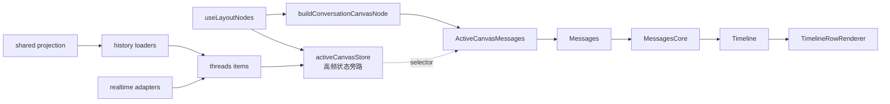

# 对话幕布结构（多 CLI + 共享会话）

> **日期**：2026-07-31（对照源码重写；删冗余，补大白话）  
> **范围**：中心对话区（幕布 / Messages 时间线）  
> **不在本文**：Intent 画板、底部 Status Panel 内部实现、Composer 输入框细节、完整 realtime 事件字典、perf 数字（见 `docs/perf/**`）  
> **事实源**：`src/features/messages/**`、`layout/hooks/**`、`threads/**`、`shared-session/**`、`conversation-presentation/**`、`live-canvas/**`

---

## 怎么读

| 你想… | 看 |
|--------|-----|
| 30 秒搞清全局 | §1 结论 + §2 术语 |
| 数据怎么变成像素 | §3 管线 |
| 「用户默认看到什么」 | §4 默认运行态 |
| Shared / 各 CLI 差在哪 | §5–§6 |
| 改代码从哪进 | §7 源码索引 |

---

## 1. 结论（默认运行态）

| 点 | 事实 | 大白话 |
|----|------|--------|
| **一套 UI 核** | 所有 native CLI + Shared 都走 `Messages → MessagesCore → MessagesTimeline → TimelineRowRenderer` | 不是 6 套聊天窗口，是一套窗口接不同水管 |
| **差异三层** | **L1 数据入口**最大；**L2 引擎硬分支**常驻；**L3 presentationProfile 默认关** | 真差别在「数据从哪来 + 写死的 if」；配置表大多在休眠 |
| **Shared 不是第七套 Row** | `threadKind=shared`，`threadId` 前缀 `shared:`；多的是历史投影 + 发送条 | 同一张画布，多了「换引擎跑」和发送状态条 |
| **Shared 引擎白名单** | `claude / codex / kimi / grok / opencode`（**无 gemini**） | Gemini 进不了共享会话 |
| **Settings 三开关** | normalized realtime=`true`；unified history=`true`；presentationProfile=`false` | 新实时/新历史默认开；「引擎皮肤表」默认关 |
| **Claude/Codex 幕布更「干净」** | bash/command 卡默认藏；活动多在 **Status Panel**（同屏兄弟，不在 Messages 树） | 命令跑了，幕布可能没卡——去底下状态面板找 |
| **文件修改场景** | 连续 edit + fileChange → `editGroup`（单条也成组）；**默认折叠**，展开才解析 diff | 一堆改文件合成「文件修改（N 个）」，先收着 |
| **流式 vs 闲时性能** | 流式：尾窗 60 + live-text 外置 + staged MD；**不**虚拟化。闲时：≥约 48 行可虚拟化 | 打字中只画尾巴；聊完了长历史才开虚拟列表 |

---

## 2. 术语（专业词 · 大白话）

| 词 | 意思 |
|----|------|
| **幕布 / Conversation Canvas** | 中间那条消息时间线；不是意图画板，也不是底栏状态面板 |
| **渲染核** | Messages 这一套 React 树；谁发消息都往这画 |
| **ConversationItem** | 时间线条目统一模型：`message / reasoning / tool / review / diff / explore / generatedImage` |
| **projection（投影行）** | 条目再加工成「要画的行」：工具分组、工作中指示、空态、审批槽位等 |
| **loader（历史加载器）** | 打开会话时，按 `threadId` 前缀把磁盘/服务端历史读进 items |
| **realtime adapter（实时适配器）** | 把引擎事件翻译成统一 item 变更，写进 reducer |
| **hard branch（引擎硬分支）** | 代码里 `if (engine === "codex")` 这类，不依赖开关也生效 |
| **presentationProfile** | 按引擎挂的「呈现皮肤」表；**默认关**，别当现网行为表 |
| **staged MD** | 流式时用轻量 Markdown 分阶段刷，少卡顿（claude+codex 写死开启） |
| **live-text externalization** | 流式正文走旁路通道，不全塞进 reducer 每字一次 |
| **virtualization（虚拟列表）** | 只挂载视口附近 DOM；闲时开，流式默认关 |
| **fileEdit 场景** | 改文件工具合成一张「文件修改」卡，默认折叠 |
| **Shared Session** | 一个会话里可切换执行引擎；历史可 merge 投影 |
| **chrome** | 幕布旁边的条/卡/对话框，不在时间线行里（如发送状态条、侧锚） |

---

## 3. 幕布在哪 · 数据怎么变像素

### 3.1 挂载（Shell → 幕布）



| 层 | 文件 | 干什么（大白话） |
|----|------|------------------|
| Layout | `layout/hooks/useLayoutNodes.tsx` | 拼会话状态、是否 Shared、Composer 旁发送条 |
| Canvas 节点 | `layout/hooks/conversationCanvasNode.tsx` | 挂 Messages + fork 对话框；**不选 heartbeat**，防 5s 心跳整树重渲 |
| 高频旁路 | `layout/hooks/activeCanvasStore.ts` | items / thinking / approvals 不走 Shell 大 props 树 |
| 门面 | `messages/components/Messages.tsx` | 旧 props 适配 → Core |
| 编排 | `messages/components/MessagesCore.tsx` | 窗口、滚动、runtime、交给 Timeline |
| 时间线 | `messages/components/MessagesTimeline.tsx` | 投影 +（可选）虚拟列表 + 逐行渲染 |
| 行分发 | `timeline/components/TimelineRowRenderer.tsx` | kind → 具体气泡/工具卡 |

### 3.2 管线（一份，勿重复画）

```text
ConversationItem[]
  → 过滤 / 去重 / 流式尾窗 / 折叠中间步骤
  → groupToolItems()
       read|bash|search：连续 ≥2 成组
       fileEdit：edit|write + fileChange 归并，≥1 即成 editGroup
  → buildTimelineProjectionRows()
       entry | workingIndicator | emptyState | approval | …
  → TimelineRowRenderer（外包 ConversationRowErrorBoundary）
```

| 步骤 | 路径 |
|------|------|
| 分组 | `messages/utils/groupToolItems.ts` |
| 投影 | `timeline/projection/messagesTimelineProjection.ts` |
| 行分发 | `timeline/components/TimelineRowRenderer.tsx` |
| 契约 kinds | `threads/contracts/conversationCurtainContracts.ts` |

### 3.3 kind → 组件

| kind | 组件 | 备注 |
|------|------|------|
| `message` | `MessageRow` | 用户/助手主气泡；流式可走 live-text |
| `reasoning` | `ReasoningRow` | 思考；Claude dock 路径默认空 |
| `tool` | `ToolBlockRenderer` 或 Group | 可被引擎策略隐藏 |
| `review` / `diff` / `explore` / `generatedImage` | `PresentationRows` 等 | 评审 / diff / 探索 / 图 |

**工具分发（单卡）**：`ToolBlockRenderer` — userInput 结果 → ExitPlan → bash → read → edit → search → MCP → Generic。  
**常态改文件**：多进 `EditToolGroupBlock`（默认折叠），不常落单卡 `EditToolBlock`。

**分组卡**

| 组 | 组件 | 策略 |
|----|------|------|
| `readGroup` | `ReadToolGroupBlock` | ≥2 连续 |
| `editGroup` | `EditToolGroupBlock` | fileEdit 桶；≥1；**默认折叠**；同 path 留最后一次；展开再算 diff |
| `bashGroup` | `BashToolGroupBlock` | codex 全藏；claude 非 transcript-fallback 时藏 |
| `searchGroup` | `SearchToolGroupBlock` | ≥2；MCP `search_query` 故意不组 |

另：`TodoWrite` / `todo_write` 分组前剔除。

**非 item 行（时间线补丁）**：`workingIndicator`（干活中）、`tailUserInput` / `approval`（表单槽）、`liveMiddleCollapsed`（中间步骤折叠）、`emptyState` / `historyRecoveryFailure`、`bottomAnchor`、`dockedReasoning`（**默认死路径**）。

**MessageRow 常挂子面**：用户长文折叠、记忆/笔记/Intent/浏览器上下文摘要、协作 badge（仅 codex）、图片、任务输出检查器、断线恢复卡。

**周边 chrome（同屏非时间线行）**

| 组件 | 说明 |
|------|------|
| `MessagesAnchorRail` | 侧栏跳用户消息（只预览 user，躲流式打穿） |
| `ScrollControl` | 贴底/跳转；含 turn-settle、scroll-echo 过滤 |
| `MessagesOutlineFloater` | 大纲；`SHOW_OUTLINE_FLOATER=false` 产品关 |
| `TurnFilesChangedCard` | 回合改文件摘要 |
| `MessageForkConfirmDialog` | fork；codex 可带 provider 选择 |
| `SharedSendStatusBar` | **仅 Shared**，Composer 上方 |
| `ProviderContinuationContextCard` | 续聊来源（timelineLeadingNode） |

---

## 4. 默认运行态（用户实际看到什么）

> 原则：**代码存在 ≠ 默认开启**。以 settings 默认值 + AppShell 硬编码 + 无 flag 的 hard branch 为准。

### 4.1 总开关

| 开关 | 默认 | 影响（大白话） |
|------|------|----------------|
| `chatCanvasUseNormalizedRealtime` | true | 实时事件走统一 adapter |
| `chatCanvasUseUnifiedHistoryLoader` | true | 历史走统一 loader 工厂 |
| `chatCanvasUsePresentationProfile` | **false** | 引擎皮肤表休眠；多数 profile 字段无效 |
| Shared projection | true（可 localStorage/env 关） | Shared 历史默认可 merge 投影 |
| `TIMELINE_ADAPTIVE_RENDERING_ENABLED` | true | 闲时虚拟化 / oversized 轻量模式的总闸 |
| idle 虚拟化门槛 | 行数 ≥**48** 或 renderWeight ≥**96** | 长历史才开虚拟列表 |
| `TIMELINE_VIRTUALIZATION_DURING_STREAMING_ENABLED` | **false** | 流式不用虚拟列表，用尾窗 60 |
| `STREAMING_VISIBLE_WINDOW` | 60 | 流式只保留近端条目 |
| `liveTextExternalization` | true（可 localStorage 回退） | 流式正文字走旁路 |
| `claudeThinkingVisible` | true（AppShell 写死） | Claude 思考默认显示；dock 遗留门闩打不开 |
| `SHOW_OUTLINE_FLOATER` | false | 大纲浮层关着 |

### 4.2 presentationProfile（默认关）

路径：`conversation-presentation/presentationProfile.ts`。仅 `usePresentationProfile===true` 时 `resolvePresentationProfile`。

| 字段 | 引擎意图 | 默认关时是否另有硬编码 |
|------|----------|------------------------|
| staged MD throttle | codex profile | **有**：claude+codex 恒 true |
| preferCommandSummary | codex | **有**：WorkingIndicator 对 codex 仍偏命令摘要 |
| codexCanvasMarkdown / showReasoningLiveDot | codex | **无** |
| heartbeatWaitingHint | opencode | **无** |

### 4.3 引擎硬分支（常驻，与 profile 无关）

| 行为 | Claude | Codex | 其他四引擎 | Shared |
|------|--------|-------|------------|--------|
| 藏 bash 单卡 | ✅ | ✅ | ❌ 原貌 | 跟当前目标引擎 |
| 藏 bashGroup | ✅* | ✅ | ❌ | 同上 |
| 协作 badge | ❌ | ✅ | ❌ | 目标=codex 时 |
| staged MD | ✅ 硬编码 | ✅ 硬编码 | ❌ | 跟目标 |
| 超长流式折叠 | ✅ | ❌ | ❌ | 跟目标 |
| activity 偏命令摘要 | ❌ | ✅ | ❌ | 目标=codex |
| Fork provider 选择 | ❌ | ✅ | ❌ | 目标=codex |
| docked reasoning | 死路径 | — | — | — |
| SharedSendStatusBar | — | — | — | ✅ 独有 |

\* Claude 在 history transcript fallback（极重历史且折叠后几乎没东西可画）时，bashGroup 可露出。

**Realtime 差异**：codex = 消息快照模式；其余 = 允许 text delta 别名。  
**History 前缀**：`shared:` / `claude:` / `gemini:` / `grok:` / `kimi:` / `opencode:` / 默认 codex。工厂：`useThreadActions.historyLoaderFactory.ts`。

**Claude dock 死路径（勿当产品能力）**

```text
legacyClaudeReasoningDockEnabled =
  engine===claude
  && typeof claudeThinkingVisible !== "boolean"  // 现网是 boolean true → 永远 false
  && shouldHideClaudeReasoningModule()
```

---

## 5. Shared Session（跨引擎单幕布）

| 项 | 值 | 大白话 |
|----|-----|--------|
| 身份 | `threadKind=shared`，`threadId` 以 `shared:` 开头 | 一看 id 就知道是共享会话 |
| 可执行引擎 | claude/codex/kimi/grok/opencode；非法回落 claude | 没有 Gemini |
| 当前目标 | `selectedTarget` / `selectedEngine` | 这一轮谁来跑 |
| 历史 | Legacy snapshot ⊕（可选）SharedProjection merge | 老快照 + 新投影拼在一起 |
| 发送 | sendStateMachine → runtime 事件进同一 items | 幕布仍只吃 ConversationItem |
| 额外 UI | SharedSendStatusBar；续聊来源卡 | 状态条在 Composer 上，不在时间线里 |

历史路径（简）：

```text
shared:id → createSharedHistoryLoader
  → loadSharedSession（legacy）
  → [projection 开] loadSharedProjection → toSharedConversationItems
  → 有 legacy 则 merge，否则仅 projection
  → normalize → setThreadItems → activeCanvasStore → Messages
```

要点：

1. `sharedProjection/dataSource.ts` **不** import native `threadItems`（隔离）。
2. 投影丢弃 `systemNotice` / `metadata`（观测面，不进幕布）。
3. 消息可带 `engineSource` / `executionTargetSnapshot`（「这轮谁跑的」痕迹）。
4. UI 行组件与 native **完全同一套**。

---

## 6. 各引擎：只记差异

> 全部汇入同一 Messages 核。差异 = **入口水管 + 上表硬分支**，不是另一棵组件树。

| 引擎 | 历史入口（大白话） | 实时 | Shared | 幕布观感 |
|------|-------------------|------|--------|----------|
| **Claude** | JSONL + shadow 恢复 | delta 别名 | ✅ | 藏 bash；staged MD；思考内联；超长可折 |
| **Codex** | resume + 本地 session 融合 | **快照**消息 | ✅ | 藏 bash；协作 badge；staged MD；fork 可选 provider |
| **Gemini** | session parser（Claude 解析器族） | delta 别名 | ❌ | 工具更「原貌」；无 staged MD 硬编码 |
| **Grok** | 本引擎 parser | delta 别名 | ✅ | 接近默认；reasoning 占位可合并 |
| **Kimi** | 本引擎 parser | delta 别名 | ✅ | 同 Grok 档：差在 loader/runtime，不在 Row 树 |
| **OpenCode** | resumeThread 快照（非本地 JSONL） | delta 别名 | ✅ | profile 心跳文案默认不生效；心跳不进 ActiveCanvas 大 props |

---

## 7. 源码索引（改代码入口）

| 主题 | 路径 |
|------|------|
| 门面 / 编排 / 时间线 | `messages/components/Messages.tsx` · `MessagesCore.tsx` · `MessagesTimeline.tsx` |
| 行分发 / 投影 / 虚拟化 | `timeline/components/TimelineRowRenderer.tsx` · `projection/…` · `virtualization/messagesTimelineVirtualization.ts` |
| 消息行 / staged MD | `rows/components/MessageRow.tsx` · `rows/presentation/messagesStreamingComplexity.ts` |
| 工具 / 文件修改场景 | `toolBlocks/ToolBlockRenderer.tsx` · `EditToolGroupBlock.tsx` · `fileEditSceneUtils.ts` · `groupToolItems.ts` |
| 轻量模式 | `presentation/messagesConversationLightweightMode.ts` |
| 滚动 echo / settle | `orchestration/scrolling/messagesScrollEcho.ts` · `hooks/useMessagesScrollController.ts` |
| Live 控件 / live-text | `live-canvas/liveCanvasControls.ts` · `threads/utils/liveAssistantTextChannel.ts` |
| Canvas 挂载 / 高频 store | `layout/hooks/conversationCanvasNode.tsx` · `activeCanvasStore.ts` · `useLayoutNodes.tsx` |
| Settings / Claude thinking | `settings/hooks/useAppSettings.ts` · `app-shell-parts/useAppShellClaudeThinkingSection.ts` |
| Loader / Shared / 引擎集 | `threads/hooks/useThreadActions.historyLoaderFactory.ts` · `loaders/sharedHistoryLoader.ts` · `shared-session/utils/sharedSessionEngines.ts` |
| 投影数据源 / Realtime 注册 | `messages/presentation/sharedProjection/dataSource.ts` · `threads/adapters/realtimeAdapterRegistry.ts` |
| Profile / 契约 | `conversation-presentation/presentationProfile.ts` · `threads/contracts/conversationCurtainContracts.ts` |

契约正文另见 `docs/chat-canvas-conversation-curtain-contracts.md`。旧 Claude/Codex 专文（`markdown-doc1/2`）行号与开关默认值已过期，以本文 + 契约为准。

---

## 8. 张力与建议（精简）

### 8.1 张力（不是 bug 列表）

| 张力 | 大白话 |
|------|--------|
| 策略分散 | 硬编码 if、profile、migration gate、localStorage 多处管同一类行为，难从一张表读懂 |
| 藏工具 vs 找工具 | Claude/Codex 幕布干净，但用户可能以为「命令丢了」——其实在 Status Panel |
| Profile 休眠 | 代码还在养，默认关，用户无感 |
| dock 死路径 | 投影/渲染还在，条件到不了 |
| 引擎观感分裂 | claude/codex「产品化」；gemini 等更「原貌」 |
| Shared 信任 | 切引擎后要能看懂「哪轮谁跑的」 |

### 8.2 建议优先级

1. **钉死默认运行态矩阵**（engine × 行为 × 代码锚点 × 是否默认开）→ 进 trellis/openspec contract。  
2. **产品二选一**：presentationProfile 默认开并补测，或把硬编码能力收敛后删冗余。  
3. **dock 死路径**：可达开关或删/debug-only。  
4. **一页信息架构文案**：幕布=叙事；Status Panel=操作痕迹；Composer=输入。  
5. **性能护栏**：流式保持尾窗优先；改 idle 虚拟化门槛必须过 virtualized-jump / scroll-echo 回归。  
6. **不做**：为每个 CLI 再拆一套 Messages；未校准前大开 profile；把 Status Panel 硬塞回幕布「为了对称」。

**最小启动包**：默认运行态矩阵 + profile go/no-go + 幕布/Status Panel 一页说明。

---

## 9. Review 清单

- [ ] 认同「一核 + L1/L2 为主 + L3 默认休眠」？  
- [ ] bash 藏幕布、活动在 Status Panel，仍是产品预期？  
- [ ] Gemini 排除 Shared：产品决策还是债？  
- [ ] profile / dock 死路径：养着还是砍？  
- [ ] 文件修改默认折叠、idle@48 虚拟化，文档与体感是否一致？

---

*结构与默认运行态说明；无实现变更。perf 以 `docs/perf/**` 为准。*
