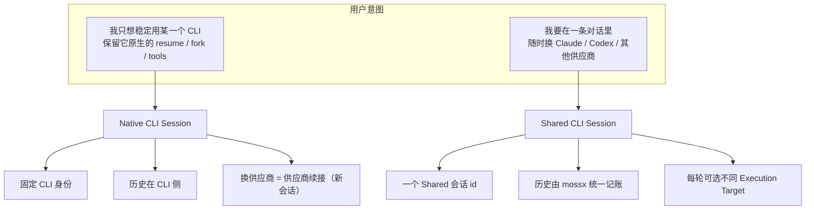
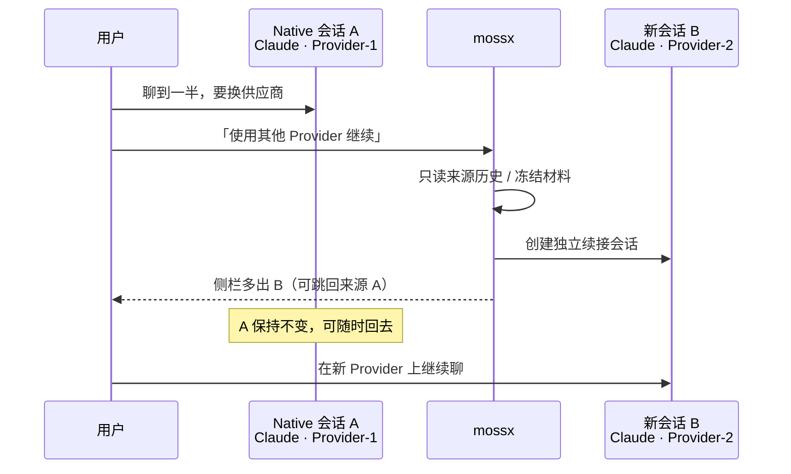
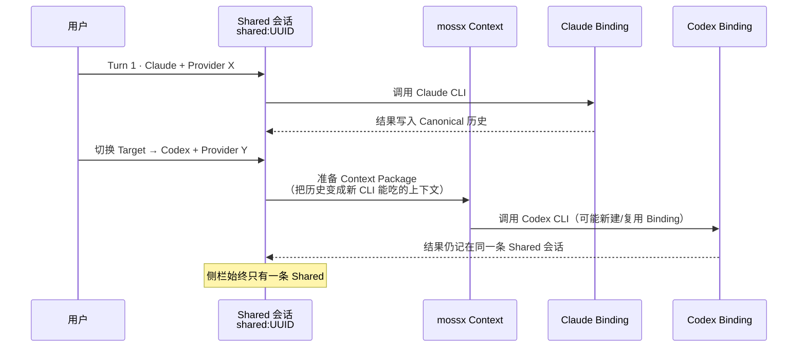
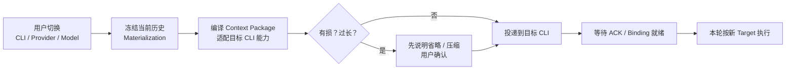
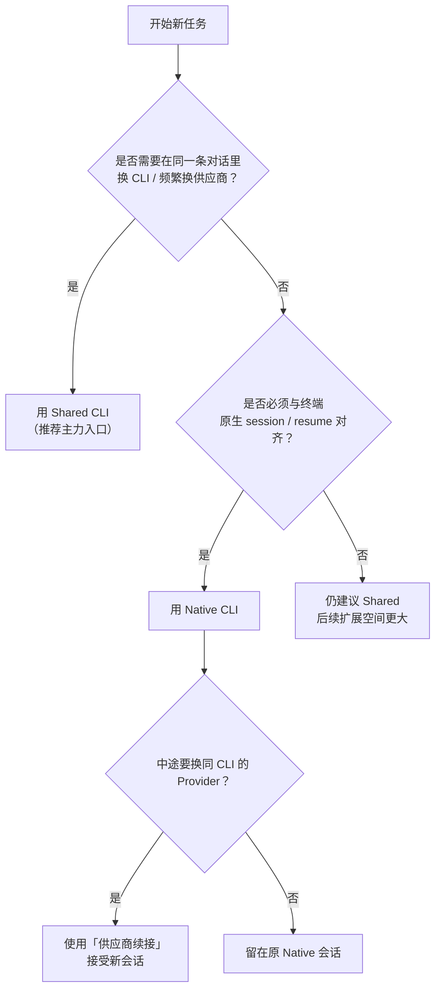

# Native CLI 与 Shared CLI：到底有什么区别？

> **内容类型**：How-to / Product Reference  
> **生命周期**：accepted（产品口径说明）  
> **最后校准**：2026-08-03  
> **读者**：首次接触 mossx 会话模型的用户、答疑同学、产品协作者  
> **姊妹文（工程契约）**：[Native / Shared 供应商与模型契约](./native-session-provider-select-vs-disk-overwrite-2026-07-31.md) · [多 CLI 会话基石设计](../research/mossx-multi-cli-provider-session-foundation-design.md)

---

## 0. 一句话回答

| | **Native CLI** | **Shared CLI** |
|--|----------------|----------------|
| **是什么** | 单一 CLI 的「原生会话」 | mossx 管理的「共享会话」 |
| **你在侧栏看到** | 一条 Claude / Codex / … 会话 | 一条 Shared Session |
| **历史归谁** | 该 CLI 自己管（原生 resume / history） | mossx 统一记账（Canonical 历史） |
| **能换什么** | 同 CLI 内可做**供应商续接**（新建一条续接会话） | **任意** CLI × Provider × Model，仍在同一条会话里 |
| **产品定位** | 必要的单点能力与原生兼容 | **客户端主力入口与编排基石** |

```text
Native  = 用好某一个 CLI 的「原生性」
Shared  = 在一条会话里自由编排多个 CLI / 供应商
```

截图里常见的困惑：

> 「native 和 shared 啥区别，我还没搞清楚」

下面按「为什么会有两种」「各自解决什么」「底层为何不能当成 SDK」三层说明。

---

## 1. 为什么会出现两种会话？

终端里直接跑 `claude` / `codex` 时，会话身份、历史文件、resume 语义都由**那一个 CLI 进程**拥有。  
mossx 不是「自己实现一套 Agent SDK」，而是**客户端壳 + 调度层**：真正干活的仍是你本机上的各个 CLI。

于是天然拆出两条产品路径：



| 路径 | 设计目标 | 不追求 |
|------|----------|--------|
| **Native** | 最大程度保留「你在终端里用这个 CLI」的语义 | 在同一条原生会话里无感换 CLI |
| **Shared** | 一条对话、多 Runtime 编排、可任意切换 | 假装只有一个底层 CLI、掩盖上下文搬运成本 |

---

## 2. 产品定位（作者口径）

### 2.1 Shared CLI：未来客户端的主力入口

- 侧栏入口常显示为 **Shared CLI** / **Claude Code + Codex** 一类命名。
- 用户面：始终只有**一条会话**；内部按「这一轮交给谁执行」切换。
- 系统面：它是**会话基石**——跨 CLI、跨 Provider、跨 Model 的切换能力都落在 Shared 上。

**适合：**

- 同一任务要对比 Claude / Codex 的产出  
- 某个供应商额度、延迟、可用性出问题，想立刻换通道继续聊  
- 希望「对话血缘」不要被拆成一堆侧栏碎片  

### 2.2 Native CLI：单一支持面，解决「终端 CLI 无法换供应商续接」

- 创建时选中某个 CLI（及当时的 Provider），会话**绑定**该 CLI 的原生身份。
- 历史、resume、fork 等继续走该 CLI 自己的规则。
- 当前增强点：**同 CLI 的供应商切换 →「供应商续接」**——不覆盖原会话，而是**派生一条新会话**，把上下文带到新 Provider。

这正是终端场景长期缺的一块：

```text
纯终端：会话 ≈ 某次 CLI 进程 + 它自己的 history 文件
        换 API / 换配置 后，往往无法「接着同一条历史聊」

Native 供应商续接：
        来源会话保持不动
        新建一条「继续：来源会话」的独立会话
        明确记录来源 → 目标，而不是静默改写磁盘 settings
```

**适合：**

- 你就是要用 Claude Code / Codex 的**完整原生能力**  
- 需要该 CLI 原生 history 与终端互通  
- 只想换**同一 CLI 下的 Provider**，而不是换整套 Runtime  

### 2.3 两者关系（不要对立理解）

```text
                    ┌─────────────────────────┐
                    │     mossx 客户端          │
                    └───────────┬─────────────┘
              ┌─────────────────┴─────────────────┐
              ▼                                   ▼
     ┌────────────────┐                 ┌────────────────────┐
     │  Shared CLI    │  主力入口 / 基石  │   Native CLI       │
     │  任意切换编排   │                 │   单 CLI 原生语义   │
     └────────┬───────┘                 └─────────┬──────────┘
              │                                   │
              │ 内部仍会为每个 Target               │ 可选
              │ 建立「隐藏的原生 Binding」           │ 「供应商续接」
              ▼                                   ▼
     ┌────────────────────────────────────────────────────┐
     │           本机 CLI 进程（Claude / Codex / …）         │
     │     mossx 调用的是 CLI，不是可随意拼装的云端 SDK      │
     └────────────────────────────────────────────────────┘
```

- Shared **不是**绕开 CLI；它是在 CLI 之上做**编排与上下文同步**。  
- Native **不是**淘汰品；它是原生兼容与「供应商续接」的专用路径。  
- 路线上：**Shared 承载主入口与任意切换；Native 承载单一支持与原生续接。**

---

## 3. 对照表：用户能感知的差异

| 维度 | Native CLI | Shared CLI |
|------|------------|------------|
| **新建入口** | 选具体引擎 / 供应商创建 | Shared CLI 入口（再选初始 CLI） |
| **会话数量（用户视角）** | 1 条 = 1 个原生会话；续接会**再多 1 条** | 始终 1 条 Shared 会话 |
| **侧栏标签** | 引擎名；续接会话有「供应商续接」等标签 | Shared Session |
| **换 Model（同 Provider）** | 在会话内切换模型（同 profile） | 改「下一轮」目标后发送 |
| **换 Provider（同 CLI）** | **供应商续接** → 新会话 | **同一会话内**改 Target，不新建侧栏会话 |
| **换 CLI** | 不支持在同一原生会话内换 | 支持（受当前 Shared 支持集合约束） |
| **历史所有权** | CLI 原生 history | mossx Canonical 事实 + 投影 |
| **崩溃 / 恢复** | Native runtime recovery | Shared recovery（**不**回退成 Native resume 卡片） |
| **与终端互通** | 强（同一套原生会话语义） | 弱（主历史在 mossx 侧） |

---

## 4. 交互示意：同一次「换供应商」

### 4.1 Native：供应商续接（新建会话）



**用户要建立的心理模型：**

- 不是「原地改了配置」  
- 而是「从 A 派生出 B，B 带着打包后的上下文」  

### 4.2 Shared：同一会话内换 Target



**用户要建立的心理模型：**

- 侧栏会话不变  
- 变的是「**下一轮由谁执行**」  
- 切换时系统可能要**准备上下文**（见下一章）——这不是卡顿 bug，而是 CLI 集成的固有成本  

---

## 5. 最大技术区别：调用的是 CLI，不是 SDK

这是理解一切「为什么要等一下 / 为什么有时要确认删减 / 为什么不能像网页 Chat 一样秒切」的钥匙。

### 5.1 两种集成方式

```text
┌─────────────────── A. 云端 SDK / 自管上下文 ───────────────────┐
│  App 自己持有 messages[]                                       │
│  换模型 = 换 API endpoint / model 字段                          │
│  上下文由 App 直接塞进下一次 HTTP 请求                           │
│  无「对方 CLI 认不认这份 history」的问题                          │
└──────────────────────────────────────────────────────────────┘

┌─────────────────── B. mossx：调用本机 CLI（当前架构）──────────┐
│  真实 Runtime = 外部 CLI 进程                                   │
│  每个 CLI 有自己的 session 文件、resume 协议、tool 状态           │
│  换 Target ≠ 改一个 model 字符串                                │
│  必须：打包上下文 → 投递到目标 CLI → 确认 ACK → 再继续对话      │
└──────────────────────────────────────────────────────────────┘
```

mossx 走的是 **B**。因此：

| 能力 | SDK 自管上下文 | mossx 调用 CLI |
|------|----------------|----------------|
| 换模型 | 通常一次 API 参数变更 | 可能仍在同一 CLI session 内，也可能要新 Binding |
| 换供应商 / 换 CLI | 若协议统一，常只需换 baseURL | **必须准备 Context Package**，目标 CLI 未必 1:1 还原全部工具轨迹 |
| 历史真相 | App 数据库即可 | Native 在 CLI 盘；Shared 在 Canonical；两边不能混用 resume |
| 失败策略 | 重试同一请求 | fail-closed：看不准就不猜、不静默跳到别的 Provider |

### 5.2 Shared 切换时，系统在干什么（用户可见的「准备上下文」）



所以你会在 Shared 里看到类似：

- 「正在为共享会话准备上下文…」  
- 有损转换时的确认（省略工具输出、压缩长历史等）  

这些不是多余流程，而是：

> **把「A CLI 眼里的对话」翻译成「B CLI 能继续的对话」。**

Native 供应商续接同样要做材料冻结与上下文编译，只是结果落在**新会话**，而不是同一条 Shared 线程。

### 5.3 为什么不能「SDK 化」一笔带过？

若 mossx 自己直接调多家 HTTP API，理论上可以完全自管 `messages`，切换会更像普通 Chat 客户端。  
但产品选择是 **复用本机 CLI 的 Agent 能力**（权限、工具、MCP、原生 history、与终端一致的行为）。代价就是：

1. **上下文所有权分裂**：CLI 与 App 各持一部分真相。  
2. **切换有编译成本**：不是改字段，是协议适配。  
3. **能力不对称**：目标 CLI 可能吃不下全部过程轨迹 → 只能有损或 fail-closed。  

一句话：

> **SDK 模式管的是「请求体」；CLI 模式管的是「对方进程认不认这份世界」。**  
> mossx 做的是后者，所以 Shared / Native 都必须围绕「准备上下文」设计，而不是假装无成本。

---

## 6. 会给用户带来哪些困扰？（提前说清楚）

| 困扰 | 为何出现 | 建议理解 / 应对 |
|------|----------|-----------------|
| **两个入口，不知选谁** | Native 保原生；Shared 保编排 | 日常多引擎切换 → **Shared**；深度用某一 CLI 原生能力 → **Native** |
| **Shared 切换要等「准备上下文」** | 底层是 CLI，不是换 API 字段 | 正常；大历史/跨 CLI 时更明显 |
| **有时要确认「历史删减」** | 目标 CLI 上下文窗口或能力不够 | 看清省略项再继续；需要完整工具轨迹时少跨 CLI |
| **Native 换供应商变成新会话** | 故意不改写原 session / 不盖盘 | 原会话还在；新会话带「续接」关系，可跳回来源 |
| **Shared 与终端 history 不完全互通** | 主账本在 mossx | 要和终端同一条 resume → 用 Native |
| **外观像同一个选择器，行为却不同** | UI 已统一成 Atomic 双栏，契约仍分叉 | Shared：只改下一轮 Target；Native 跨渠道：可能走续接 |
| **恢复卡片 / 失败提示不一样** | Shared 与 Native recovery 分属不同 owner | Shared 失败不会「假装成」Native resume |

---

## 7. 怎么选？（决策树）



**简记：**

1. **默认选 Shared**——产品主航道，任意切换的基石。  
2. **为原生语义选 Native**——单 CLI 深潜 + 终端一致性。  
3. **Native 上换供应商 = 续接出新会话**，不是原地改绑。  
4. **切换成本来自「调用 CLI + 准备上下文」**，不是界面多此一举。

---

## 8. 术语速查

| 词 | 含义 |
|----|------|
| **CLI / Engine** | 执行 Agent 的本机程序：Claude Code、Codex、… |
| **Provider** | 该 CLI 使用的 API / 渠道配置（官方、OpenRouter、自定义网关等） |
| **Model** | 本轮具体模型名 |
| **Execution Target** | 完整的「下一轮谁执行」：CLI + Provider + Model + Reasoning |
| **Native Session** | 绑定单一 CLI 原生身份的会话 |
| **Shared Session** | mossx 管理的共享会话；用户侧一条，内部可多 Target |
| **Binding** | Shared 内部为某个 CLI+Provider 保存的隐藏原生连接 |
| **Context Package** | 切换目标时打包、转换后的历史上下文 |
| **供应商续接 (Provider Continuation)** | Native 路径上：从来源会话派生到新 Provider 的新会话 |
| **Canonical Fact** | Shared 统一记账的事实流水；投影成聊天 UI |

---

## 9. 给答疑同学的标准回复（可复制）

> **Native** 和 **Shared** 不是两个随便起的名字，而是两种会话模型：  
>  
> - **Shared CLI** 是 mossx 客户端的**主力入口**：一条会话里可以按轮切换不同 CLI、供应商和模型，历史由 mossx 统一管理。  
> - **Native CLI** 是**单一 CLI 的原生支持**：会话身份和历史跟该 CLI 对齐；目前支持的「供应商切换」走的是**供应商续接**——原会话不动，新建一条带上下文的续接会话，用来补终端 CLI 很难做到的「换供应商接着聊」。  
>  
> 底层我们调用的是**本机 CLI**，不是自管 messages 的 SDK。所以换目标时需要**准备上下文**（有时还有有损确认）。这是架构边界，不是多余步骤。  
>  
> 想自由切换、一条对话走完：用 **Shared**。  
> 想吃透某一个 CLI 的原生能力、或和终端 history 对齐：用 **Native**。

---

## 10. 延伸阅读

| 文档 | 读什么 |
|------|--------|
| [多 CLI 会话基石设计](../research/mossx-multi-cli-provider-session-foundation-design.md) | ADR：Native / Shared 边界与不变量 |
| [Native / Shared 供应商与模型契约](./native-session-provider-select-vs-disk-overwrite-2026-07-31.md) | 工程契约：L1/L2、next-target、不盖盘 |
| [A–D 影响与手测计划](../reports/multi-cli-session-foundation-a-d-impact-and-manual-test-plan-2026-07-28.md) | 用户可感知变化与验收路径 |
| [Shared 选择器误入 Native 续接](./shared-session-model-picker-native-fallback-2026-08-02.md) | 为何「看起来像同一选择器」行为却可能分叉（及修复） |

---

## 变更记录

| 日期 | 说明 |
|------|------|
| 2026-08-03 | 初版：回应用户「native / shared 区别」；固化产品定位（Shared 主力、Native 单点与供应商续接）与「CLI 非 SDK / 必须准备上下文」的技术分水岭 |
